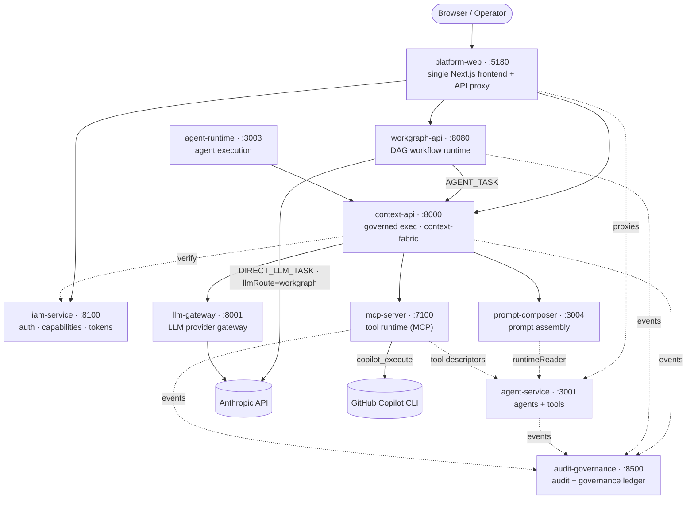
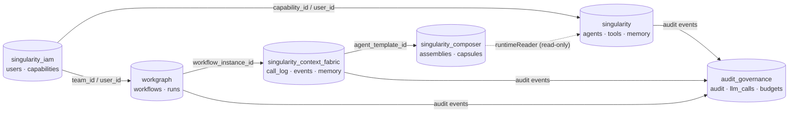
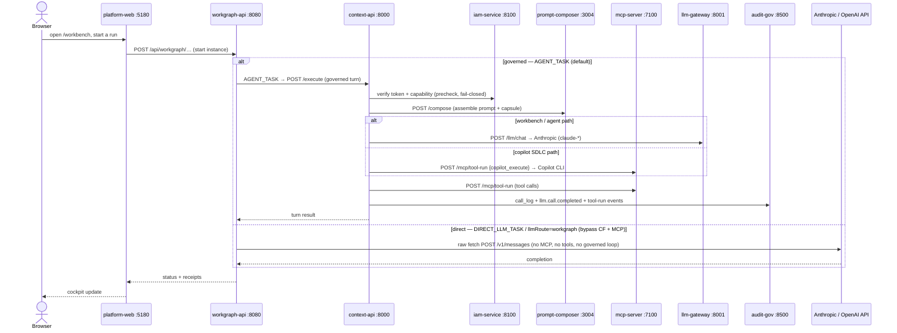
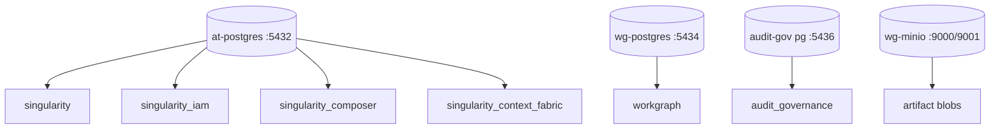
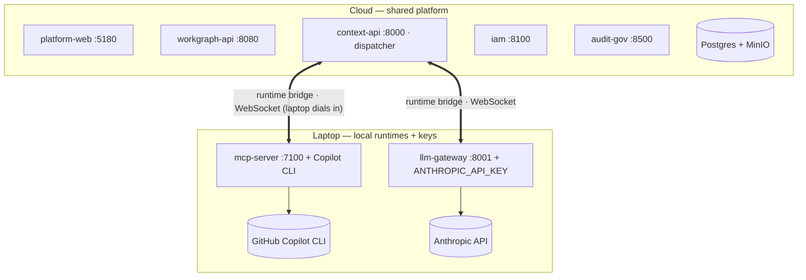

# Architecture Overview

How the Singularity platform fits together after the consolidation — **one frontend, ~9 backend services, six databases, two LLM execution paths.** Diagrams are Mermaid (GitHub renders them inline). For the per-database ERDs see [`data-model/00-platform-overview.md`](./data-model/00-platform-overview.md); for testing the two LLM paths see [`testing-copilot-and-anthropic.md`](./testing-copilot-and-anthropic.md).

---

## 1. Service architecture & connections

`platform-web` is the single origin; the **governed-run path** (`workgraph-api → context-api → backends`) is the spine. `iam-service` and `audit-governance` are cross-cutting — every service verifies tokens with IAM and emits events to audit-gov.

Solid = request/exec API · dotted = verify + audit (every service) · `agent-service` (:3001) serves **both** `/api/v1/agents` and `/api/v1/tools` (tool-service merged in). `context-memory` (:8002), `formal-verifier` (:8010), and `prompt-compressor` (:8011, compression profile) are optional and omitted above. **`workgraph-api` can also call the provider directly** — the `WG → Anthropic API` edge — for `DIRECT_LLM_TASK` nodes (or `AGENT_TASK` with `config.llmRoute: workgraph|direct`), a raw `fetch` that bypasses Context Fabric, MCP, and the LLM gateway (no tools, no governed loop); see the direct-LLM note under the run sequence below.

---

## 2. Data model

Six **disjoint** Postgres databases, each owned by exactly one service. No foreign-data-wrappers and no SQL joins across databases — they connect only through opaque UUID keys carried in payloads.

| Database | Owner service | Port | Authoritative for |
|---|---|---|---|
| `singularity_iam` | iam-service (Python) | 5432 | users, teams, business units, capabilities, roles, permissions, MCP servers, devices, IAM audit events |
| `singularity` | agent-service + agent-runtime | 5432 | agent templates, tool registry (`tool.*`), tool grants, capability metadata, code symbols, `learning.*`, distilled memory |
| `singularity_composer` | prompt-composer | 5432 | prompt profiles, layers, assemblies, stage bindings, compiled-context capsules |
| `workgraph` | workgraph-api | 5434 | workflow designs, instances, nodes, edges, tasks, approvals, agent-runs, tool-runs, triggers |
| `audit_governance` | audit-gov | 5436 | audit events, LLM calls, budgets, rate limits, authz decisions, evaluator runs |
| `singularity_context_fabric` | context-api | 5432 | `call_log` (per-turn calls), `events_store` (governed run events), `context_memory` |

**Cross-DB join keys** (opaque UUIDs, flow in JSON payloads / columns; no FK enforcement):

| Key | Origin | Consumed by |
|---|---|---|
| `capability_id` | `singularity_iam.capabilities` | `singularity.Capability` (mirror), `workgraph.capabilities`, `composer.PromptAssembly`, `audit.audit_events`, every invoke envelope |
| `user_id` | `singularity_iam.users` | `audit.audit_events.actor_id`, `singularity.AgentExecution.createdBy`, `workgraph.users`, device tokens |
| `team_id` | `singularity_iam.teams` | `workgraph.teams`, `iam.team_memberships` |
| `agent_template_id` | `singularity.AgentTemplate` | `composer.PromptAssembly`, `workgraph.agent_runs` |
| `tool_definition_id` | `singularity.ToolDefinition` | `singularity.ToolGrant`, `workgraph.tools`, `tool.tools` mirror |
| `workflow_instance_id` | `workgraph.workflow_instances` | `composer.PromptAssembly`, `audit.audit_events.subject_id`, invoke envelopes |
| `prompt_assembly_id` | `composer.PromptAssembly` | `workgraph.agent_runs`, `audit.audit_events`, cf CallLog |
| `trace_id` | minted at the edge (workgraph or cf) | `audit.audit_events`, `composer.PromptAssembly`, mcp ring buffers, every `governance.precheck` |

---

## 3. API call flow — one governed agent run

The **two governed LLM paths are mutually exclusive per stage**: workbench + agent runs go through the LLM gateway (Anthropic); copilot-mode SDLC stages are delegated to the Copilot CLI via `mcp-server` and captured as a diff receipt.

### Direct LLM path (non-governed, bypasses MCP + Context Fabric)

There is also a **third, non-governed route**. A `DIRECT_LLM_TASK` node — or an `AGENT_TASK` whose `config.llmRoute` is `workgraph`/`direct` (`agentTaskUsesWorkGraphLlm`) — is executed **entirely inside `workgraph-api`** by `DirectLlmTaskExecutor` (`workgraph-studio/apps/api/src/modules/workflow/runtime/executors/DirectLlmTaskExecutor.ts`). It calls the provider with a raw `fetch` — `https://api.anthropic.com/v1/messages` (or an OpenAI-compatible `/chat/completions`); API key from an **env var** (`credentialEnv`, default `ANTHROPIC_API_KEY`/`OPENAI_API_KEY`), provider/model/baseURL from the `llmConnection` registry or node config — **bypassing Context Fabric, MCP, tool dispatch, and the LLM gateway**. Calls are non-streaming; runs are stamped `bypassedContextFabric`/`bypassedMcp` and stored as a `DIRECT_LLM_OUTPUT` consumable. It does **no** tool discovery or governed phasing; grounding is optional (a prompt-composer *preview* compose with tools disabled, only when an `agentTemplateId` is configured, via `DirectLlmHarness`).

This is distinct from Context Fabric's own env-gated `CONTEXT_FABRIC_DIRECT_LLM_*` mode (which is *CF* calling a provider directly). Use the workgraph direct path for cheap/ungoverned LLM steps where MCP tools + the governed loop aren't needed; use governed `AGENT_TASK` (default) when you want tools, grounding, budgets, and audit.

---

## 4. API reference (base paths + key endpoints + callers)

| Service | Base | Key endpoints | Called by |
|---|---|---|---|
| platform-web | `:5180` | `/api/*` Next routes; proxies `/api/agents`,`/api/tools`→agent-service · `/api/workgraph`→workgraph-api · `/api/cf`→context-api · `/api/audit-gov`→audit-gov · `/api/composer`→prompt-composer | Browser |
| iam-service | `:8100/api/v1` | `/auth/local/login`, `/auth/service-token`, `/auth/device-token`, `/auth/verify`, `/users`, `/capabilities`, `/mcp-servers` | all services (verify), platform-web |
| agent-service | `:3001/api/v1` | `/agents`, `/tools`, `/internal-tools`, `/connector-tools`, `/client-runners`, `/events/subscriptions` | platform-web, workgraph-api, mcp-server |
| agent-runtime | `:3003/api/v1` | `/runtime/*` (agent execution) | platform-web, workgraph-api |
| prompt-composer | `:3004` | `/compose`, `/health` | context-api |
| context-api | `:8000` | `/execute`, runtime-bridge, `/health` | workgraph-api, agent-runtime, platform-web |
| workgraph-api | `:8080` | `/api/workflows`, `/api/instances`, `/api/connectors/:id/invoke`, `/api/internal/artifacts/fetch` | platform-web, context-api |
| mcp-server | `:7100` | `/mcp/tool-run`, `/mcp/resources/*`, `/health` | context-api, agent-runtime |
| llm-gateway | `:8001` | `/llm/chat`, `/llm/models`, `/health` | context-api, prompt-composer, agent-runtime |
| audit-gov | `:8500` | `/events`, `/llm-calls`, `/budgets` | all services (fire-and-forget) |

> Storage: `at-postgres` :5432 (shared app/IAM/composer/context-fabric), `wg-postgres` :5434 (workgraph), audit-gov :5436, `wg-minio` :9000/:9001 (artifacts). In Docker the `platform-core` container bundles agent-service + agent-runtime + prompt-composer.

---

## 5. Ports & storage map

| Service | Port | Profile |
|---|---|---|
| platform-web | 5180 | core |
| iam-service | 8100 | core |
| agent-service (agents + tools) | 3001 | core |
| agent-runtime | 3003 | core |
| prompt-composer | 3004 | core |
| context-api | 8000 | core |
| workgraph-api | 8080 | core |
| audit-governance | 8500 | core (`--with-audit`) |
| mcp-server | 7100 | optional / runtime |
| llm-gateway | 8001 | optional / runtime |
| context-memory | 8002 | optional |
| formal-verifier | 8010 | optional |
| prompt-compressor | 8011 | compression |

| Storage backend | Port | Holds |
|---|---|---|
| `at-postgres` | 5432 | `singularity`, `singularity_iam`, `singularity_composer`, `singularity_context_fabric` |
| `wg-postgres` | 5434 | `workgraph` |
| audit-gov postgres | 5436 | `audit_governance` |
| `wg-minio` | 9000 / 9001 | artifact blobs (object store) |

---

## 6. Laptop + cloud hybrid (Copilot + Anthropic)

The platform supports a **hybrid** where the shared services run in the cloud, but the **`llm-gateway` and `mcp-server` run on your laptop** — `mcp-server` with the **GitHub Copilot CLI**, `llm-gateway` with a local **`ANTHROPIC_API_KEY`**. The laptop **dials into** the cloud `context-api` over the **runtime bridge** (WebSocket). `context-api` dispatches tool-run / model-run frames to the laptop (userId-routed); results return over the same bridge. This keeps API keys + the Copilot CLI local while orchestration and data stay cloud-side. See [`hybrid-laptop-deployment.md`](./hybrid-laptop-deployment.md) and [`testing-copilot-and-anthropic.md`](./testing-copilot-and-anthropic.md).

**Invariant:** workbench + agent runs use the LLM gateway (Anthropic); copilot-mode SDLC stages use the Copilot CLI via `mcp-server`. The two paths never share a stage.
