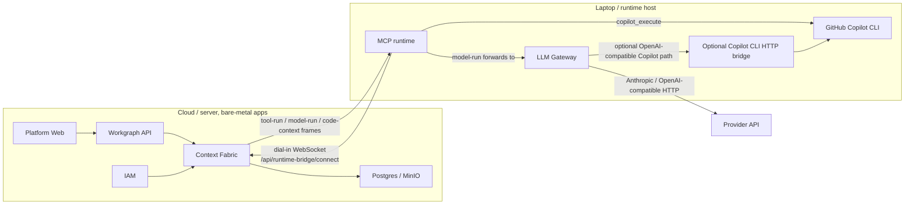

# Bare-Metal Cloud With Laptop MCP and LLM

This runbook covers the deployment shape where the cloud/server runs the
standard platform applications outside Docker, while MCP and LLM run on a
laptop or another runtime host. The runtime host dials out to Context Fabric
over the Runtime Bridge WebSocket. No inbound MCP or LLM port is required on
the laptop for the normal path.

Use this when:

- Cloud/server runs the platform apps as normal processes, not Docker Compose.
- MCP runtime and LLM Gateway run on a laptop or separate runtime machine.
- LLM traffic should support both direct provider APIs, such as Anthropic or
  OpenAI-compatible endpoints, and GitHub Copilot based workflows.
- Provider keys must stay beside the laptop LLM Gateway, not on the cloud
  server.

In this document, "OpenAI-compatible" means an HTTP endpoint that accepts the
OpenAI-style `/v1/chat/completions` contract. It is not referring to the
OpenAPI schema format.

## Topology



## Service Placement

| Component | Runs on cloud/server | Runs on laptop/runtime host |
|---|---:|---:|
| IAM | yes | no |
| Context Fabric / `context-api` | yes | no |
| Workgraph API | yes | no |
| Platform Web | yes | no |
| Agent/tools platform services | yes | no |
| Postgres / MinIO | yes | no, unless local test |
| MCP runtime | no | yes |
| LLM Gateway | no | yes |
| Provider API keys | no | yes |
| Copilot CLI login/subscription | no | yes |
| Git token for repo clone/push | no, unless cloud git stages are used | yes for Copilot SDLC |

Do not use Docker service names such as `http://llm-gateway:8001` in this
topology. That DNS name only exists inside Docker Compose. On the laptop,
`LLM_GATEWAY_URL` is normally `http://localhost:8001`.

## Secrets and Identity

### `JWT_SECRET`

`JWT_SECRET` is a shared signing secret used by Context Fabric to verify the
runtime JWT that the laptop presents during WebSocket registration. It is not
downloaded from GitHub, Anthropic, or OpenAI.

Generate it once:

```bash
openssl rand -base64 48
```

Use the same value on:

- cloud/server platform apps, especially IAM and Context Fabric
- laptop/runtime host when minting and starting the MCP runtime

If the cloud and laptop use different values, MCP registration fails with a
WebSocket `403`.

For current bare-metal testing, the helper script can mint the runtime JWT
locally with this shared secret. Long term, IAM should mint runtime tokens via
an authenticated API so the laptop does not need the raw `JWT_SECRET`.

### Runtime JWT Keying

The current runtime JWT uses:

- `kind=runtime`
- `sub=<iam-user-id>`
- `runtime_id=<stable-runtime-id>`
- `runtime_type=mcp`
- optional runtime scope and capability tags

Context Fabric routes user-owned runtime work by the IAM user id. The JWT
`sub` must match the user who launches the workflow run. If the run is launched
by a different user, Context Fabric will not select that laptop runtime.

### Provider Secrets

Provider keys live only on the laptop/runtime host, normally in
`.env.llm-secrets`:

```bash
ANTHROPIC_API_KEY=sk-ant-...
OPENAI_API_KEY=sk-...
OPENROUTER_API_KEY=...
COPILOT_TOKEN=...
```

Only set the keys you actually use. Do not copy provider keys into cloud app
environment files.

`GITHUB_TOKEN` is different. It is for repo clone/push and GitHub API work. It
is not the Copilot CLI model credential. The Copilot CLI uses its own local
login/subscription state.

## Cloud Setup

Run this on the cloud/server.

1. Export deployment-level environment:

```bash
export JWT_SECRET='<generated-secret>'
export RUNTIME_HTTP_FALLBACK_ENABLED=false
export PREFER_LAPTOP_LLM=true
```

`RUNTIME_HTTP_FALLBACK_ENABLED=false` makes runtime traffic fail closed when no
runtime is connected. This is the normal production-style path.

`PREFER_LAPTOP_LLM=true` tells Context Fabric to send model calls to the
launching user's connected runtime when possible. MCP then forwards `model-run`
frames to the laptop LLM Gateway.

2. Start cloud application services only:

```bash
bin/bare-metal-apps.sh up <db_user> <db_password> <db_host> <db_port>
```

This wrapper intentionally starts platform application services and skips the
runtime pair:

- no `mcp-server`
- no `llm-gateway`

Do not run `bin/bare-metal-runtime.sh up` on the cloud server for this topology.

3. Verify the cloud apps:

```bash
curl -fsS http://<cloud-host>:8000/health
curl -fsS http://<cloud-host>:8080/health
curl -fsS http://<cloud-host>:8100/api/v1/health
curl -fsS http://<cloud-host>:5180/
```

4. Verify no runtime is connected yet:

```bash
curl -s http://<cloud-host>:8000/api/runtime-bridge/status | jq
```

Expected before the laptop starts:

```json
{
  "status": "ok",
  "connected": [],
  "count": 0
}
```

## Find the IAM User Id

The runtime token must be minted for the same IAM user that will launch runs.

After logging in, get the current user from IAM:

```bash
curl -H "authorization: Bearer <platform-user-token>" \
  http://<cloud-host>:8100/api/v1/me | jq
```

Use the returned user id or JWT `sub` as `<iam-user-id>`.

## Laptop Runtime Setup

Run this on the laptop/runtime host.

### One-Command Setup

The recommended laptop operator entrypoint is:

```bash
bin/mcp-runtime-setup.sh connect \
  --context-fabric-url http://<cloud-host>:8000 \
  --iam-user-id <iam-user-id> \
  --jwt-secret '<same-generated-secret-as-cloud>' \
  --github-token "$GITHUB_TOKEN" \
  --anthropic-api-key "$ANTHROPIC_API_KEY"
```

The script:

- writes GitHub/Copilot runtime settings to gitignored `.env.laptop`
- writes provider keys to gitignored `.env.llm-secrets`
- mints or stores `.singularity/laptop-device-token`
- starts local `llm-gateway` on `:8001`
- starts local `mcp-server` in Runtime Bridge dial-in mode
- polls cloud Context Fabric until the runtime appears connected
- prints the LLM providers and model aliases available from the laptop gateway

For Copilot as an OpenAI-compatible LLM provider, first start the local bridge:

```bash
node bin/copilot-cli-server.js --port 4141
```

Then connect the runtime:

```bash
bin/mcp-runtime-setup.sh connect \
  --context-fabric-url http://<cloud-host>:8000 \
  --iam-user-id <iam-user-id> \
  --jwt-secret '<same-generated-secret-as-cloud>' \
  --github-token "$GITHUB_TOKEN" \
  --copilot-token copilot-local \
  --copilot-base-url http://localhost:4141/v1 \
  --default-provider copilot \
  --default-model gpt-4o
```

Useful follow-ups:

```bash
bin/mcp-runtime-setup.sh status
bin/mcp-runtime-setup.sh logs mcp-server
bin/mcp-runtime-setup.sh logs llm-gateway
bin/mcp-runtime-setup.sh down
```

The lower-level manual flow remains below for debugging or for cases where the
runtime JWT is minted by IAM outside the laptop.

1. Export cloud connection details:

```bash
export JWT_SECRET='<same-generated-secret-as-cloud>'
export RUNTIME_BRIDGE_URL=ws://<cloud-host>:8000/api/runtime-bridge/connect
```

Use `wss://.../api/runtime-bridge/connect` when the cloud endpoint is behind
TLS.

2. Mint the runtime JWT for the launching IAM user:

```bash
bin/laptop-bridge.sh mint-token <iam-user-id>
```

This writes:

```text
.singularity/laptop-device-token
```

3. Configure provider secrets on the laptop:

```bash
cat > .env.llm-secrets <<'EOF'
ANTHROPIC_API_KEY=sk-ant-...
# OPENAI_API_KEY=sk-...
# OPENROUTER_API_KEY=...
# COPILOT_TOKEN=copilot-local
EOF
chmod 600 .env.llm-secrets
```

4. Start the laptop LLM Gateway:

```bash
bin/laptop-bridge.sh gateway
```

Keep this terminal open.

5. Start the laptop MCP runtime in dial-in mode:

```bash
bin/laptop-bridge.sh mcp
```

Keep this terminal open. MCP should log that it is connecting to the runtime
bridge.

6. Verify from the cloud/server:

```bash
curl -s http://<cloud-host>:8000/api/runtime-bridge/status | jq
```

Expected:

- `count` is at least `1`
- runtime type is `mcp`
- supported frames include `tool-run`, `model-run`, and `code-context`
- user id matches the user who will launch the workflow run

## Test Path A: Anthropic or OpenAI-Compatible Provider

This tests the normal LLM Gateway path:

```text
Cloud Context Fabric -> Runtime Bridge -> Laptop MCP -> Laptop LLM Gateway -> Provider API
```

### Anthropic Example

On the laptop, configure `.singularity/llm-providers.json`:

```json
{
  "defaultProvider": "anthropic",
  "defaultModel": "claude-sonnet-4-6",
  "allowedProviders": ["anthropic", "mock"],
  "providers": {
    "anthropic": {
      "enabled": true,
      "baseUrl": "https://api.anthropic.com",
      "credentialEnv": "ANTHROPIC_API_KEY",
      "defaultModel": "claude-sonnet-4-6",
      "supportsTools": true
    },
    "mock": {
      "enabled": true,
      "defaultModel": "mock-fast"
    }
  }
}
```

Make sure `.env.llm-secrets` contains:

```bash
ANTHROPIC_API_KEY=sk-ant-...
```

Restart only the laptop gateway:

```bash
# Stop the gateway terminal with Ctrl-C, then start it again.
bin/laptop-bridge.sh gateway
```

Smoke test locally on the laptop:

```bash
curl -s http://localhost:8001/llm/providers | jq

curl -s -X POST http://localhost:8001/v1/chat/completions \
  -H 'content-type: application/json' \
  -d '{
    "model_alias": "claude-sonnet-4-6",
    "messages": [{"role": "user", "content": "Reply with anthropic-ok"}],
    "max_tokens": 20
  }' | jq
```

Then launch a governed workflow from the cloud UI. The laptop MCP terminal
should show `model-run` activity, and the laptop gateway should serve the
provider call.

### OpenAI-Compatible Example

Use this for providers that accept OpenAI-style `/chat/completions`.

```json
{
  "defaultProvider": "openai",
  "defaultModel": "gpt-4o",
  "allowedProviders": ["openai", "mock"],
  "providers": {
    "openai": {
      "enabled": true,
      "baseUrl": "https://api.openai.com/v1",
      "credentialEnv": "OPENAI_API_KEY",
      "defaultModel": "gpt-4o",
      "supportsTools": true
    },
    "mock": {
      "enabled": true,
      "defaultModel": "mock-fast"
    }
  }
}
```

For a private OpenAI-compatible endpoint, keep `provider` as `openai` and
change `baseUrl` to the private endpoint, for example:

```json
"baseUrl": "https://llm.internal.example.com/v1"
```

The endpoint must be reachable from the laptop LLM Gateway process.

## Test Path B: Copilot CLI Executor

This tests the SDLC coding executor path:

```text
Cloud Context Fabric -> Runtime Bridge -> Laptop MCP -> copilot_execute -> GitHub Copilot CLI
```

This path does not use the LLM Gateway as a Copilot provider. MCP shells out to
the installed GitHub Copilot CLI:

```text
copilot -p "<task>" --allow-all
```

1. Install and sign into the official Copilot CLI on the laptop:

```bash
which copilot
copilot --help
copilot
```

2. Export the binary if it is not on the default PATH:

```bash
export COPILOT_BIN="$(which copilot)"
```

3. Optional, enable git push for SDLC workflows:

```bash
export MCP_GIT_PUSH_ENABLED=true
export MCP_GIT_AUTH_MODE=token
export GITHUB_TOKEN=ghp_...
```

4. Restart the laptop MCP runtime:

```bash
# Stop the MCP terminal with Ctrl-C, then start it again.
bin/laptop-bridge.sh mcp
```

5. Launch a Copilot SDLC workflow from the cloud UI. The workflow node must
have:

```json
{
  "executor": "copilot"
}
```

6. Watch laptop MCP logs for:

```text
copilot_execute -> copilot -p
copilot_execute <- completed
```

The workflow run should show:

- changed files
- artifacts
- diff
- `copilot_execution` receipt
- optional commit SHA

## Test Path C: Copilot Through an OpenAI-Compatible Gateway

This tests Copilot as a model provider through the laptop LLM Gateway:

```text
Cloud Context Fabric -> Runtime Bridge -> Laptop MCP -> Laptop LLM Gateway -> Copilot CLI bridge -> Copilot CLI
```

Start the local Copilot CLI HTTP bridge on the laptop:

```bash
node bin/copilot-cli-server.js --port 4141
```

In another laptop terminal, point the LLM Gateway config to that bridge:

```bash
bin/llm-use-copilot.sh \
  --base-url http://localhost:4141/v1 \
  --model gpt-4o \
  --token copilot-local
```

Verify:

```bash
curl -s http://localhost:8001/llm/providers | jq
curl -s http://localhost:8001/llm/models | jq
```

Smoke:

```bash
curl -s -X POST http://localhost:8001/v1/chat/completions \
  -H 'content-type: application/json' \
  -d '{
    "model_alias": "gpt-4o",
    "messages": [{"role": "user", "content": "Reply with copilot-llm-ok"}],
    "max_tokens": 20
  }' | jq
```

Notes:

- This is separate from `copilot_execute`.
- The bridge converts OpenAI-compatible HTTP calls into Copilot CLI calls.
- Direct `https://api.githubcopilot.com` is not the recommended path today
  because the current gateway adapter does not send the editor-specific headers
  that endpoint usually expects.
- `bin/llm-use-copilot.sh --preset github-models --token <GITHUB_PAT>` is a
  separate GitHub Models path. It requires a GitHub PAT with model access.

Restore the previous provider config:

```bash
bin/llm-use-copilot.sh --restore
```

## Switching Between Providers

The provider switch happens in the laptop LLM Gateway config, not in MCP.

Files:

```text
.singularity/llm-providers.json
.singularity/llm-models.json
.env.llm-secrets
```

After changing provider config:

1. Restart the laptop LLM Gateway.
2. Restart MCP only if its `/llm/providers` display or model catalog looks
   stale. Runtime `model-run` calls are forwarded to the gateway.

Useful checks:

```bash
curl -s http://localhost:8001/llm/providers | jq
curl -s http://localhost:8001/llm/models | jq
curl -s http://<cloud-host>:8000/api/runtime-bridge/status | jq
```

## What To Look For

| Test | Expected evidence |
|---|---|
| Runtime bridge registration | cloud `/api/runtime-bridge/status` shows one connected MCP runtime |
| Anthropic/OpenAI-compatible LLM | laptop gateway `/llm/providers` shows provider `ready=true` |
| Cloud workflow using laptop LLM | laptop MCP logs show `model-run` frames |
| Copilot SDLC executor | laptop MCP logs show `copilot_execute -> copilot -p` |
| Copilot as LLM provider | laptop gateway routes model aliases to provider `copilot` and local bridge receives `/v1/chat/completions` |
| Artifacts and receipts | Workgraph run page shows changed files, artifacts, receipts, and run metrics |

## Troubleshooting

| Symptom | Likely cause | Fix |
|---|---|---|
| WebSocket registration returns `403` | `JWT_SECRET` mismatch, expired token, or token signed with old secret | Export the same `JWT_SECRET` on cloud and laptop, re-run `bin/laptop-bridge.sh mint-token <iam-user-id>`, restart MCP |
| `/api/runtime-bridge/status` shows `count: 0` | MCP not running, wrong `RUNTIME_BRIDGE_URL`, firewall, or cloud Context Fabric down | Check laptop MCP logs, verify `curl http://<cloud-host>:8000/health`, use `ws://` or `wss://` correctly |
| Workflow fails with `RUNTIME_NOT_CONNECTED` | No connected runtime for the launching user | Confirm JWT `sub` equals the IAM user id that launched the run |
| Workflow uses cloud/debug path | `RUNTIME_HTTP_FALLBACK_ENABLED=true` or run explicitly opted out of laptop | Set fallback to `false`, remove `prefer_laptop=false` from the run |
| Anthropic provider says `Missing credential` | `ANTHROPIC_API_KEY` is not loaded by laptop gateway | Put it in `.env.llm-secrets`, restart `bin/laptop-bridge.sh gateway` |
| Copilot executor fails to spawn | Copilot CLI not installed or not on PATH for MCP process | Set `COPILOT_BIN=/absolute/path/to/copilot`, restart MCP |
| `GITHUB_TOKEN` exists but Copilot still fails | GitHub token is not Copilot CLI auth | Run `copilot` locally and complete Copilot CLI sign-in |
| Wrong clone appears in `/llm/providers` paths | Another repo clone owns port `8001` | Stop the other gateway process, then restart this repo's gateway |
| Direct `api.githubcopilot.com` returns 400/403 | Gateway does not send editor-specific Copilot headers | Use `bin/copilot-cli-server.js` or GitHub Models preset instead |

## Security Notes

- Do not commit `.env.llm-secrets`, `.env.local`, `.singularity/laptop-device-token`,
  or provider keys.
- Keep provider keys on the laptop/runtime host.
- Keep `JWT_SECRET` out of git and rotate it if it is exposed.
- Re-mint runtime tokens after rotating `JWT_SECRET`.
- Prefer `RUNTIME_HTTP_FALLBACK_ENABLED=false` for real deployments.
- For production, replace manual shared-secret runtime token minting with an
  IAM-minted runtime token flow.
