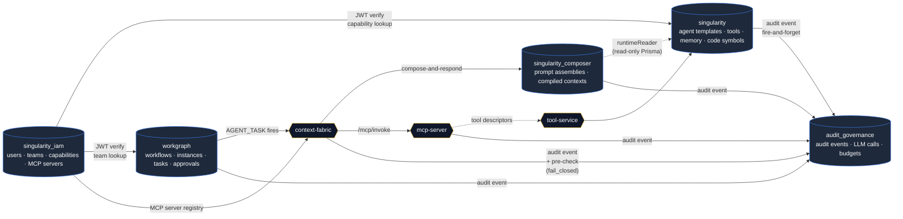

# Platform Data-Model Overview

> **Hand-curated.** This is the single page that maps the Singularity platform's data across the 5 Postgres databases. Each per-DB ERD is linked at the bottom.

## The 5 databases

After M30 the platform owns **five disjoint Postgres databases**. Each is owned by exactly one service; cross-service references go through application-layer code (HTTP calls or, for prompt-composer specifically, a read-only Prisma client). There are no foreign-data-wrappers and no SQL-level joins across DBs.

| DB | Owner service | Port | Authoritative for |
|---|---|---|---|
| `singularity_iam` | `singularity-iam-service` (Python/FastAPI/SQLAlchemy) | 5433 | users, teams, BUs, capabilities, roles, permissions, MCP servers, user devices, audit events |
| `singularity` | `agent-and-tools/apps/agent-runtime` + `tool-service` (Prisma + raw SQL) | 5432 | agent templates, capability runtime metadata, tool registry, code symbols, knowledge artifacts, distilled memory |
| `singularity_composer` | `agent-and-tools/apps/prompt-composer` (Prisma) | 5432 | prompt profiles, prompt layers, prompt assemblies, compiled-context capsules |
| `workgraph` | `workgraph-studio/apps/api` (Prisma) | 5434 | workflow designs, instances, nodes, edges, tasks, approvals, consumables, triggers, agent-runs, tool-runs |
| `audit_governance` | `audit-governance-service` (raw SQL) | 5436 | audit events, LLM calls, budgets, rate limits, approvals (governance side), authz decisions, evaluator runs |

## How the data flows



**Read-only edge (dotted):** prompt-composer's `runtimeReader` Prisma client connects to `singularity` to read AgentTemplate / Capability / DistilledMemory / etc. It **never** runs `prisma db push` against that DB — agent-runtime owns the DDL.

## Cross-DB UUID join keys

These IDs are the only "joins" between databases. They flow as opaque UUIDs in JSON payloads or columns; there is no FK enforcement.

| UUID | Origin DB.table | Carried in (consumers) |
|---|---|---|
| **`capability_id`** | `singularity_iam.capabilities.id` | `singularity.Capability` (mirror), `workgraph.capabilities` (cache), `singularity_composer.PromptAssembly.capabilityId`, `audit_governance.audit_events.capability_id`, every MCP invoke envelope |
| **`user_id`** | `singularity_iam.users.id` | `audit_governance.audit_events.actor_id`, `singularity.AgentExecution.createdBy`, `workgraph.users.externalIamUserId`, `singularity_iam.user_devices.user_id` |
| **`team_id`** | `singularity_iam.teams.id` | `workgraph.teams.externalIamTeamId`, `singularity_iam.team_memberships.team_id` |
| **`agent_template_id`** | `singularity.AgentTemplate.id` | `singularity_composer.PromptAssembly.agentTemplateId`, `workgraph.agent_runs.agentTemplateId` (also `workgraph.agents.externalTemplateId` snapshot), MCP invoke envelopes |
| **`tool_definition_id`** | `singularity.ToolDefinition.id` | `singularity.ToolGrant.toolId`, `workgraph.tools.externalToolId` (snapshot), `tool.tools.id` (tool-service mirror in `singularity`) |
| **`workflow_instance_id`** | `workgraph.workflow_instances.id` | `singularity_composer.PromptAssembly.workflowExecutionId`, `audit_governance.audit_events.subject_id` (when `subject_type='WorkflowInstance'`), MCP invoke envelopes |
| **`trace_id`** | minted at the edge (workgraph mints one per AgentRun; cf mints if absent) | `audit_governance.audit_events.trace_id`, `singularity_composer.PromptAssembly.traceId`, `mcp-server` in-memory ring buffers (`/mcp/resources/*?trace_id=…`), every `governance.precheck` event |
| **`mcp_server_id`** | `singularity_iam.mcp_servers.id` | `audit_governance.audit_events.payload.mcpServerId`, cf `/execute` response correlation |
| **`prompt_assembly_id`** | `singularity_composer.PromptAssembly.id` | `workgraph.agent_runs.promptAssemblyId` (referential), `audit_governance.audit_events.payload.promptAssemblyId`, cf CallLog |
| **`compiled_context_id`** | `singularity_composer.CapabilityCompiledContext.id` | `singularity_composer.PromptAssembly.compiledContextId` (capsule-hit marker) |

## Per-DB ERDs

| # | Diagram | Generated by | Models |
|---|---|---|---|
| 01 | [IAM](./01-iam.md) | hand-written (SQLAlchemy source) | 20 |
| 02 | [agent-runtime](./02-agent-runtime.md) ([PNG](./02-agent-runtime.png)) | auto (`prisma-erd-generator`) | 25 |
| 03a | [prompt-composer — OWNED](./03-prompt-composer-owned.md) ([PNG](./03-prompt-composer-owned.png)) | auto | 6 |
| 03b | [prompt-composer — RUNTIME-READ](./03-prompt-composer-runtime-read.md) ([PNG](./03-prompt-composer-runtime-read.png)) | auto | 12 (read-only mirror) |
| 04 | [workgraph](./04-workgraph.md) | auto (markdown only — too big for legible PNG) | 76 |
| 05 | [audit-gov](./05-audit-gov.md) | hand-written (raw SQL DDL source) | 11 |
| 06 | [tool-service](./06-tool-service.md) | hand-written (raw SQL DDL source; lives inside `singularity.tool.*` schema) | 8 |

## Regenerating after schema changes

The four Prisma-owned ERDs are emitted as a side-effect of `prisma generate`. The CI `data-model-drift` job re-runs every schema's `prisma generate` and asserts the committed ERD files in this folder are byte-identical. To regenerate locally:

```bash
# All four Prisma services in one go
( cd agent-and-tools/apps/agent-runtime && DATABASE_URL=<…> npx prisma generate )
( cd agent-and-tools/apps/prompt-composer && DATABASE_URL=<…> npx prisma generate --schema=prisma/schema.prisma )
( cd agent-and-tools/apps/prompt-composer && DATABASE_URL_RUNTIME_READ=<…> npx prisma generate --schema=prisma/runtime-read.prisma )
( cd workgraph-studio/apps/api && DATABASE_URL=<…> npx prisma generate )
```

The hand-written diagrams (IAM, audit-gov, tool-service) need manual updates when their source DDL/models change. CI has no drift gate for those — the schemas are stable enough that drift is rare.
