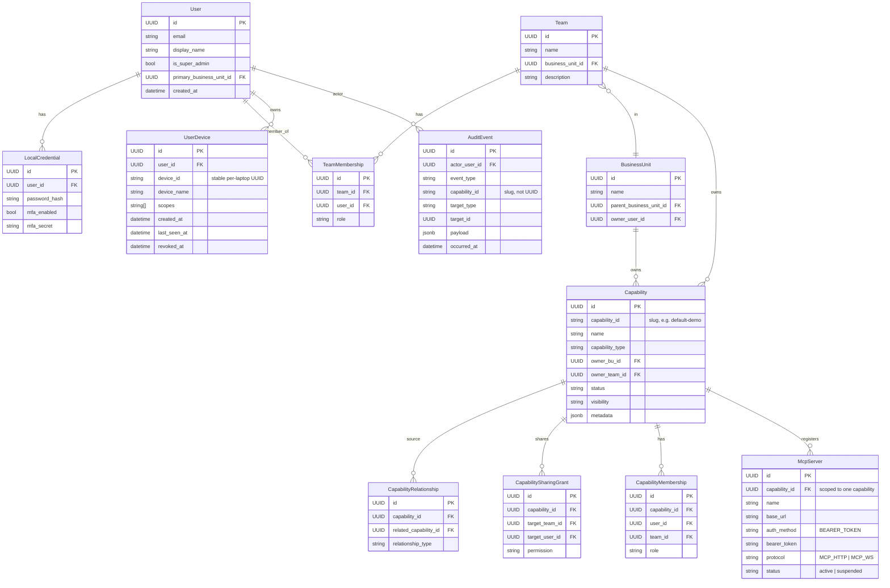
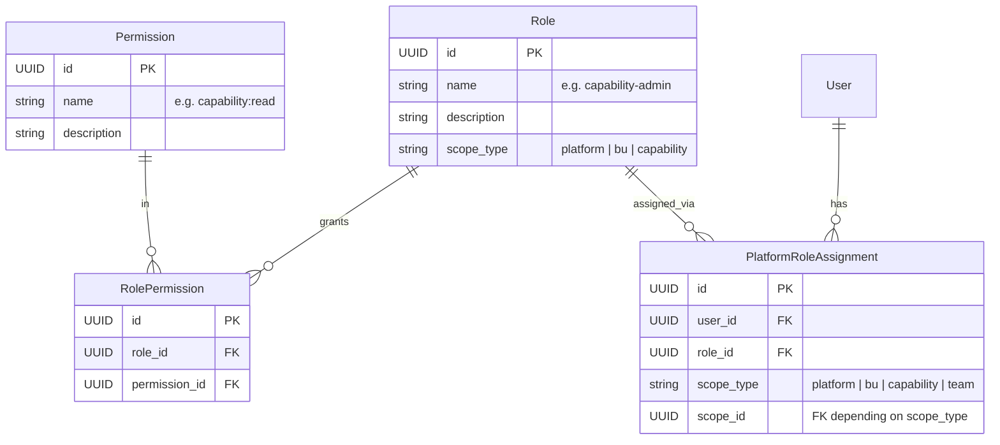
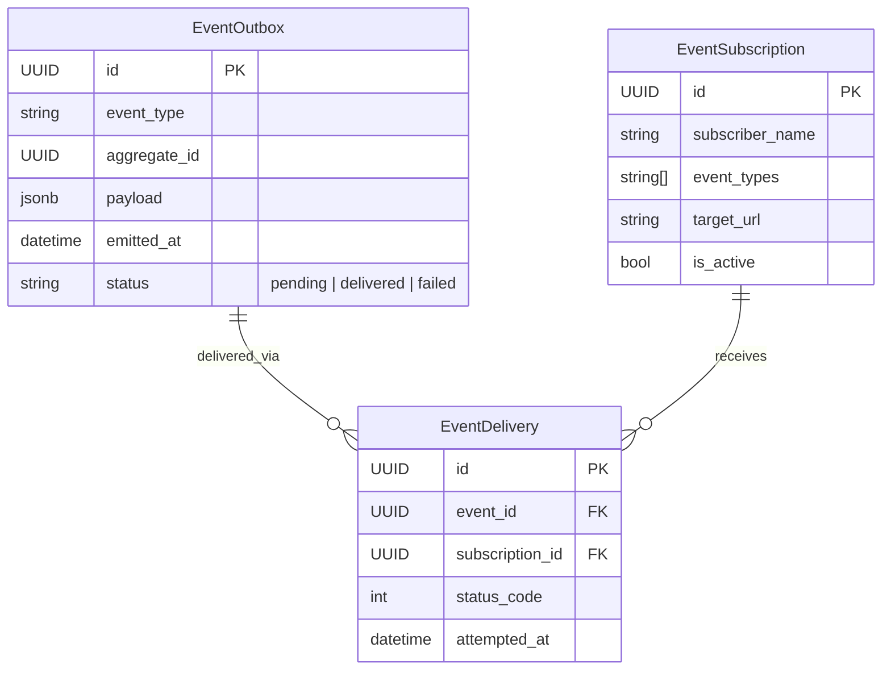

# IAM — `singularity_iam`

> **Hand-curated.** Source of truth: [`singularity-iam-service/app/models.py`](../../singularity-iam-service/app/models.py) (SQLAlchemy declarative). 20 tables. Edit this file when the SQLAlchemy models change.

Owner: `singularity-iam-service` (FastAPI · Python · SQLAlchemy 2.x · asyncpg).

IAM is the **identity + authorization source of truth**. Every other service either holds a UUID reference to an IAM row (via `capability_id`, `user_id`, `team_id`) or talks to IAM over HTTP. There is no FK enforcement between DBs.

## Core entities

## Authorization (RBAC)

## Event outbox (IAM → audit-gov)

## Cross-DB outbound references

| Column | Used by |
|---|---|
| `User.id`                | every service via JWT `sub` claim |
| `Capability.id`          | `singularity.Capability` (mirror), `singularity_composer.PromptAssembly.capabilityId`, `workgraph.capabilities` (cache), `audit_governance.audit_events.capability_id` |
| `Team.id`                | `workgraph.teams.externalIamTeamId` |
| `McpServer.id`           | `audit_governance.audit_events.payload.mcpServerId`, cf `/execute` response correlation |
| `Skill.id`               | `workgraph.skills.externalIamSkillId` |
| `UserDevice.id`          | M26 device-token JWT `device_id` claim; carried by laptop-mode mcp-server invokes |
