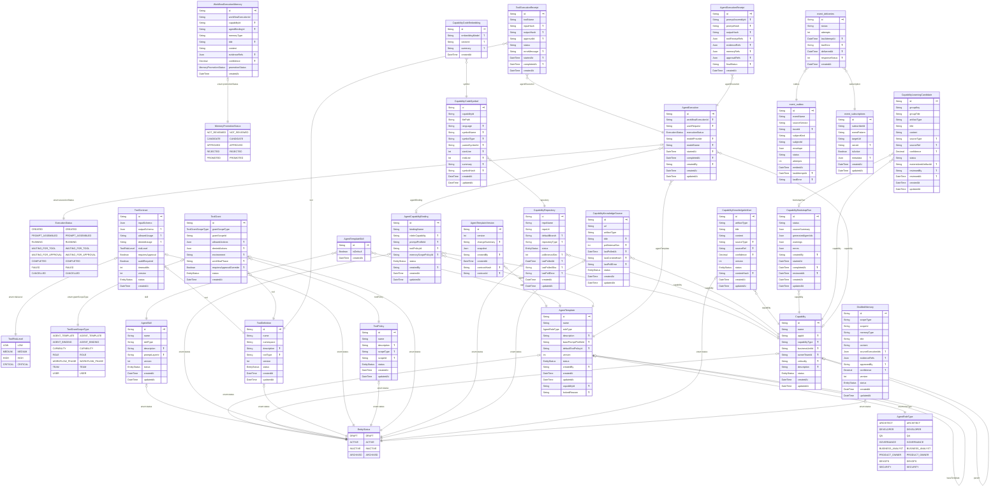

```mermaid
erDiagram

        EntityStatus {
            DRAFT DRAFT
ACTIVE ACTIVE
INACTIVE INACTIVE
ARCHIVED ARCHIVED
        }
    


        AgentRoleType {
            ARCHITECT ARCHITECT
DEVELOPER DEVELOPER
QA QA
GOVERNANCE GOVERNANCE
BUSINESS_ANALYST BUSINESS_ANALYST
PRODUCT_OWNER PRODUCT_OWNER
DEVOPS DEVOPS
SECURITY SECURITY
        }
    


        ToolRiskLevel {
            LOW LOW
MEDIUM MEDIUM
HIGH HIGH
CRITICAL CRITICAL
        }
    


        ToolGrantScopeType {
            AGENT_TEMPLATE AGENT_TEMPLATE
AGENT_BINDING AGENT_BINDING
CAPABILITY CAPABILITY
ROLE ROLE
WORKFLOW_PHASE WORKFLOW_PHASE
TEAM TEAM
USER USER
        }
    


        ExecutionStatus {
            CREATED CREATED
PROMPT_ASSEMBLED PROMPT_ASSEMBLED
RUNNING RUNNING
WAITING_FOR_TOOL WAITING_FOR_TOOL
WAITING_FOR_APPROVAL WAITING_FOR_APPROVAL
COMPLETED COMPLETED
FAILED FAILED
CANCELLED CANCELLED
        }
    


        MemoryPromotionStatus {
            NOT_REVIEWED NOT_REVIEWED
CANDIDATE CANDIDATE
APPROVED APPROVED
REJECTED REJECTED
PROMOTED PROMOTED
        }
    
  "AgentTemplate" {
    String id "🗝️"
    String name 
    AgentRoleType roleType 
    String description "❓"
    String basePromptProfileId "❓"
    String defaultToolPolicyId "❓"
    Int version 
    EntityStatus status 
    String createdBy "❓"
    DateTime createdAt 
    DateTime updatedAt 
    String capabilityId "❓"
    String lockedReason "❓"
    }
  

  "AgentTemplateVersion" {
    String id "🗝️"
    Int version 
    String changeSummary "❓"
    Json snapshot 
    String createdBy "❓"
    DateTime createdAt 
    String contractHash "❓"
    String contractId "❓"
    }
  

  "AgentSkill" {
    String id "🗝️"
    String name 
    String skillType 
    String description "❓"
    String promptLayerId "❓"
    Int version 
    EntityStatus status 
    DateTime createdAt 
    DateTime updatedAt 
    }
  

  "AgentTemplateSkill" {
    String id "🗝️"
    Boolean isDefault 
    DateTime createdAt 
    }
  

  "Capability" {
    String id "🗝️"
    String name 
    String appId "❓"
    String capabilityType "❓"
    String businessUnitId "❓"
    String ownerTeamId "❓"
    String criticality "❓"
    String description "❓"
    EntityStatus status 
    DateTime createdAt 
    DateTime updatedAt 
    }
  

  "AgentCapabilityBinding" {
    String id "🗝️"
    String bindingName 
    String roleInCapability "❓"
    String promptProfileId "❓"
    String toolPolicyId "❓"
    String memoryScopePolicyId "❓"
    EntityStatus status 
    String createdBy "❓"
    DateTime createdAt 
    DateTime updatedAt 
    }
  

  "ToolDefinition" {
    String id "🗝️"
    String name 
    String namespace 
    String description "❓"
    String toolType "❓"
    Int version 
    EntityStatus status 
    DateTime createdAt 
    DateTime updatedAt 
    }
  

  "ToolContract" {
    String id "🗝️"
    Json inputSchema 
    Json outputSchema "❓"
    String allowedUsage "❓"
    String deniedUsage "❓"
    ToolRiskLevel riskLevel 
    Boolean requiresApproval 
    Boolean auditRequired 
    Int timeoutMs 
    Int version 
    EntityStatus status 
    DateTime createdAt 
    }
  

  "ToolPolicy" {
    String id "🗝️"
    String name 
    String description "❓"
    String scopeType "❓"
    String scopeId "❓"
    EntityStatus status 
    DateTime createdAt 
    DateTime updatedAt 
    }
  

  "ToolGrant" {
    String id "🗝️"
    ToolGrantScopeType grantScopeType 
    String grantScopeId 
    Json allowedActions "❓"
    Json deniedActions "❓"
    String environment "❓"
    String workflowPhase "❓"
    Boolean requiresApprovalOverride "❓"
    EntityStatus status 
    DateTime createdAt 
    }
  

  "CapabilityRepository" {
    String id "🗝️"
    String repoName 
    String repoUrl 
    String defaultBranch "❓"
    String repositoryType "❓"
    EntityStatus status 
    Int pollIntervalSec "❓"
    DateTime lastPolledAt "❓"
    String lastPolledSha "❓"
    String lastPollError "❓"
    DateTime createdAt 
    DateTime updatedAt 
    }
  

  "CapabilityKnowledgeSource" {
    String id "🗝️"
    String url 
    String artifactType 
    String title "❓"
    Int pollIntervalSec "❓"
    DateTime lastPolledAt "❓"
    String lastContentHash "❓"
    String lastPollError "❓"
    EntityStatus status 
    DateTime createdAt 
    DateTime updatedAt 
    }
  

  "CapabilityKnowledgeArtifact" {
    String id "🗝️"
    String artifactType 
    String title 
    String content 
    String sourceType "❓"
    String sourceRef "❓"
    Decimal confidence "❓"
    Int version 
    EntityStatus status 
    String contentHash "❓"
    DateTime createdAt 
    DateTime updatedAt 
    }
  

  "CapabilityBootstrapRun" {
    String id "🗝️"
    String status 
    Json sourceSummary 
    Json generatedAgentIds 
    Json warnings 
    Json errors 
    String createdBy "❓"
    DateTime startedAt 
    DateTime completedAt "❓"
    DateTime reviewedAt "❓"
    DateTime createdAt 
    DateTime updatedAt 
    }
  

  "CapabilityLearningCandidate" {
    String id "🗝️"
    String groupKey 
    String groupTitle 
    String artifactType 
    String title 
    String content 
    String sourceType "❓"
    String sourceRef "❓"
    Decimal confidence "❓"
    String status 
    String materializedArtifactId "❓"
    String reviewedBy "❓"
    DateTime reviewedAt "❓"
    DateTime createdAt 
    DateTime updatedAt 
    }
  

  "CapabilityCodeSymbol" {
    String id "🗝️"
    String capabilityId 
    String filePath 
    String language "❓"
    String symbolName "❓"
    String symbolType "❓"
    String parentSymbolId "❓"
    Int startLine "❓"
    Int endLine "❓"
    String summary "❓"
    String symbolHash "❓"
    DateTime createdAt 
    DateTime updatedAt 
    }
  

  "CapabilityCodeEmbedding" {
    String id "🗝️"
    String embeddingModel "❓"
    String vectorId "❓"
    String summary "❓"
    DateTime createdAt 
    }
  

  "AgentExecution" {
    String id "🗝️"
    String workflowExecutionId "❓"
    String userRequest "❓"
    ExecutionStatus executionStatus 
    String modelProvider "❓"
    String modelName "❓"
    DateTime startedAt "❓"
    DateTime completedAt "❓"
    String createdBy "❓"
    DateTime createdAt 
    DateTime updatedAt 
    }
  

  "ToolExecutionReceipt" {
    String id "🗝️"
    String toolName 
    String inputHash "❓"
    String outputHash "❓"
    String approvalId "❓"
    String status 
    String errorMessage "❓"
    DateTime startedAt "❓"
    DateTime completedAt "❓"
    DateTime createdAt 
    }
  

  "AgentExecutionReceipt" {
    String id "🗝️"
    String promptAssemblyId "❓"
    String promptHash "❓"
    String outputHash "❓"
    Json toolReceiptRefs "❓"
    Json evidenceRefs "❓"
    Json memoryRefs "❓"
    Json approvalRefs "❓"
    String finalStatus "❓"
    DateTime createdAt 
    }
  

  "WorkflowExecutionMemory" {
    String id "🗝️"
    String workflowExecutionId 
    String capabilityId "❓"
    String agentBindingId "❓"
    String memoryType 
    String title "❓"
    String content 
    Json evidenceRefs "❓"
    Decimal confidence "❓"
    MemoryPromotionStatus promotionStatus 
    DateTime createdAt 
    }
  

  "DistilledMemory" {
    String id "🗝️"
    String scopeType 
    String scopeId 
    String memoryType 
    String title 
    String content 
    Json sourceExecutionIds "❓"
    Json evidenceRefs "❓"
    String approvedBy "❓"
    Decimal confidence "❓"
    Int version 
    EntityStatus status 
    DateTime createdAt 
    DateTime updatedAt 
    }
  

  "event_outbox" {
    String id "🗝️"
    String eventName 
    String sourceService 
    String traceId "❓"
    String subjectKind 
    String subjectId 
    Json envelope 
    String status 
    Int attempts 
    DateTime emittedAt 
    DateTime lastAttemptAt "❓"
    String lastError "❓"
    }
  

  "event_subscriptions" {
    String id "🗝️"
    String subscriberId 
    String eventPattern 
    String targetUrl 
    String secret "❓"
    Boolean isActive 
    Json metadata "❓"
    DateTime createdAt 
    DateTime updatedAt 
    }
  

  "event_deliveries" {
    String id "🗝️"
    String status 
    Int attempts 
    DateTime lastAttemptAt "❓"
    String lastError "❓"
    DateTime deliveredAt "❓"
    Int responseStatus "❓"
    DateTime createdAt 
    }
  
    "AgentTemplate" |o--|| "AgentRoleType" : "enum:roleType"
    "AgentTemplate" |o--|| "EntityStatus" : "enum:status"
    "AgentTemplate" |o--|o "AgentTemplate" : "baseTemplate"
    "AgentTemplateVersion" }o--|| "AgentTemplate" : "agentTemplate"
    "AgentSkill" |o--|| "EntityStatus" : "enum:status"
    "AgentTemplateSkill" }o--|| "AgentTemplate" : "agentTemplate"
    "AgentTemplateSkill" }o--|| "AgentSkill" : "skill"
    "Capability" |o--|| "EntityStatus" : "enum:status"
    "Capability" |o--|o "Capability" : "parent"
    "AgentCapabilityBinding" |o--|| "EntityStatus" : "enum:status"
    "AgentCapabilityBinding" }o--|| "AgentTemplate" : "agentTemplate"
    "AgentCapabilityBinding" }o--|| "Capability" : "capability"
    "ToolDefinition" |o--|| "EntityStatus" : "enum:status"
    "ToolContract" |o--|| "ToolRiskLevel" : "enum:riskLevel"
    "ToolContract" |o--|| "EntityStatus" : "enum:status"
    "ToolContract" }o--|| "ToolDefinition" : "tool"
    "ToolPolicy" |o--|| "EntityStatus" : "enum:status"
    "ToolGrant" |o--|| "ToolGrantScopeType" : "enum:grantScopeType"
    "ToolGrant" |o--|| "EntityStatus" : "enum:status"
    "ToolGrant" }o--|| "ToolPolicy" : "toolPolicy"
    "ToolGrant" }o--|| "ToolDefinition" : "tool"
    "CapabilityRepository" |o--|| "EntityStatus" : "enum:status"
    "CapabilityRepository" }o--|| "Capability" : "capability"
    "CapabilityKnowledgeSource" |o--|| "EntityStatus" : "enum:status"
    "CapabilityKnowledgeSource" }o--|| "Capability" : "capability"
    "CapabilityKnowledgeArtifact" |o--|| "EntityStatus" : "enum:status"
    "CapabilityKnowledgeArtifact" }o--|| "Capability" : "capability"
    "CapabilityBootstrapRun" }o--|| "Capability" : "capability"
    "CapabilityLearningCandidate" }o--|| "Capability" : "capability"
    "CapabilityLearningCandidate" }o--|o "CapabilityBootstrapRun" : "bootstrapRun"
    "CapabilityCodeSymbol" }o--|| "CapabilityRepository" : "repository"
    "CapabilityCodeEmbedding" }o--|| "CapabilityCodeSymbol" : "symbol"
    "AgentExecution" |o--|| "ExecutionStatus" : "enum:executionStatus"
    "AgentExecution" }o--|o "Capability" : "capability"
    "AgentExecution" }o--|| "AgentTemplate" : "agentTemplate"
    "AgentExecution" }o--|o "AgentCapabilityBinding" : "agentBinding"
    "ToolExecutionReceipt" }o--|| "AgentExecution" : "agentExecution"
    "ToolExecutionReceipt" }o--|| "ToolDefinition" : "tool"
    "AgentExecutionReceipt" }o--|| "AgentExecution" : "agentExecution"
    "WorkflowExecutionMemory" |o--|| "MemoryPromotionStatus" : "enum:promotionStatus"
    "DistilledMemory" |o--|| "EntityStatus" : "enum:status"
    "event_deliveries" }o--|| event_outbox : "outbox"
    "event_deliveries" }o--|| event_subscriptions : "subscription"
```
