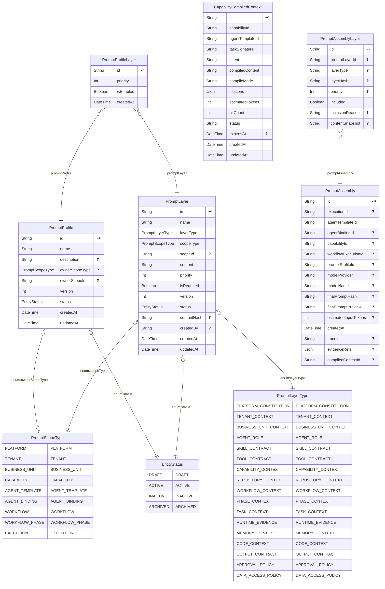

```mermaid
erDiagram

        EntityStatus {
            DRAFT DRAFT
ACTIVE ACTIVE
INACTIVE INACTIVE
ARCHIVED ARCHIVED
        }
    


        PromptScopeType {
            PLATFORM PLATFORM
TENANT TENANT
BUSINESS_UNIT BUSINESS_UNIT
CAPABILITY CAPABILITY
AGENT_TEMPLATE AGENT_TEMPLATE
AGENT_BINDING AGENT_BINDING
WORKFLOW WORKFLOW
WORKFLOW_PHASE WORKFLOW_PHASE
EXECUTION EXECUTION
        }
    


        PromptLayerType {
            PLATFORM_CONSTITUTION PLATFORM_CONSTITUTION
TENANT_CONTEXT TENANT_CONTEXT
BUSINESS_UNIT_CONTEXT BUSINESS_UNIT_CONTEXT
AGENT_ROLE AGENT_ROLE
SKILL_CONTRACT SKILL_CONTRACT
TOOL_CONTRACT TOOL_CONTRACT
CAPABILITY_CONTEXT CAPABILITY_CONTEXT
REPOSITORY_CONTEXT REPOSITORY_CONTEXT
WORKFLOW_CONTEXT WORKFLOW_CONTEXT
PHASE_CONTEXT PHASE_CONTEXT
TASK_CONTEXT TASK_CONTEXT
RUNTIME_EVIDENCE RUNTIME_EVIDENCE
MEMORY_CONTEXT MEMORY_CONTEXT
CODE_CONTEXT CODE_CONTEXT
OUTPUT_CONTRACT OUTPUT_CONTRACT
APPROVAL_POLICY APPROVAL_POLICY
DATA_ACCESS_POLICY DATA_ACCESS_POLICY
        }
    
  "PromptProfile" {
    String id "🗝️"
    String name 
    String description "❓"
    PromptScopeType ownerScopeType "❓"
    String ownerScopeId "❓"
    Int version 
    EntityStatus status 
    DateTime createdAt 
    DateTime updatedAt 
    }
  

  "PromptLayer" {
    String id "🗝️"
    String name 
    PromptLayerType layerType 
    PromptScopeType scopeType 
    String scopeId "❓"
    String content 
    Int priority 
    Boolean isRequired 
    Int version 
    EntityStatus status 
    String contentHash "❓"
    String createdBy "❓"
    DateTime createdAt 
    DateTime updatedAt 
    }
  

  "PromptProfileLayer" {
    String id "🗝️"
    Int priority 
    Boolean isEnabled 
    DateTime createdAt 
    }
  

  "PromptAssembly" {
    String id "🗝️"
    String executionId "❓"
    String agentTemplateId 
    String agentBindingId "❓"
    String capabilityId "❓"
    String workflowExecutionId "❓"
    String promptProfileId "❓"
    String modelProvider "❓"
    String modelName "❓"
    String finalPromptHash "❓"
    String finalPromptPreview "❓"
    Int estimatedInputTokens "❓"
    DateTime createdAt 
    String traceId "❓"
    Json evidenceRefs "❓"
    String compiledContextId "❓"
    }
  

  "CapabilityCompiledContext" {
    String id "🗝️"
    String capabilityId 
    String agentTemplateId 
    String taskSignature 
    String intent 
    String compiledContent 
    String compileMode 
    Json citations 
    Int estimatedTokens 
    Int hitCount 
    String status 
    DateTime expiresAt "❓"
    DateTime createdAt 
    DateTime updatedAt 
    }
  

  "PromptAssemblyLayer" {
    String id "🗝️"
    String promptLayerId "❓"
    String layerType "❓"
    String layerHash "❓"
    Int priority "❓"
    Boolean included 
    String inclusionReason "❓"
    String contentSnapshot "❓"
    }
  
    "PromptProfile" |o--|o "PromptScopeType" : "enum:ownerScopeType"
    "PromptProfile" |o--|| "EntityStatus" : "enum:status"
    "PromptLayer" |o--|| "PromptLayerType" : "enum:layerType"
    "PromptLayer" |o--|| "PromptScopeType" : "enum:scopeType"
    "PromptLayer" |o--|| "EntityStatus" : "enum:status"
    "PromptProfileLayer" }o--|| "PromptProfile" : "promptProfile"
    "PromptProfileLayer" }o--|| "PromptLayer" : "promptLayer"
    "PromptAssemblyLayer" }o--|| "PromptAssembly" : "promptAssembly"
```
