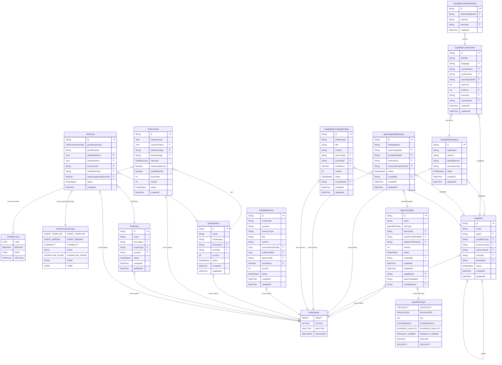

```mermaid
erDiagram

        EntityStatus {
            DRAFT DRAFT
ACTIVE ACTIVE
INACTIVE INACTIVE
ARCHIVED ARCHIVED
        }
    


        AgentRoleType {
            ARCHITECT ARCHITECT
DEVELOPER DEVELOPER
QA QA
GOVERNANCE GOVERNANCE
BUSINESS_ANALYST BUSINESS_ANALYST
PRODUCT_OWNER PRODUCT_OWNER
DEVOPS DEVOPS
SECURITY SECURITY
        }
    


        ToolRiskLevel {
            LOW LOW
MEDIUM MEDIUM
HIGH HIGH
CRITICAL CRITICAL
        }
    


        ToolGrantScopeType {
            AGENT_TEMPLATE AGENT_TEMPLATE
AGENT_BINDING AGENT_BINDING
CAPABILITY CAPABILITY
ROLE ROLE
WORKFLOW_PHASE WORKFLOW_PHASE
TEAM TEAM
USER USER
        }
    
  "AgentTemplate" {
    String id "🗝️"
    String name 
    AgentRoleType roleType 
    String description "❓"
    String basePromptProfileId "❓"
    String defaultToolPolicyId "❓"
    Int version 
    EntityStatus status 
    String createdBy "❓"
    DateTime createdAt 
    DateTime updatedAt 
    String capabilityId "❓"
    String baseTemplateId "❓"
    String lockedReason "❓"
    }
  

  "Capability" {
    String id "🗝️"
    String name 
    String appId "❓"
    String capabilityType "❓"
    String businessUnitId "❓"
    String ownerTeamId "❓"
    String criticality "❓"
    String description "❓"
    EntityStatus status 
    DateTime createdAt 
    DateTime updatedAt 
    }
  

  "CapabilityRepository" {
    String id "🗝️"
    String repoName 
    String repoUrl 
    String defaultBranch 
    String repositoryType 
    EntityStatus status 
    DateTime createdAt 
    DateTime updatedAt 
    }
  

  "CapabilityCodeSymbol" {
    String id "🗝️"
    String filePath 
    String language "❓"
    String symbolName "❓"
    String symbolType "❓"
    String parentSymbolId "❓"
    Int startLine "❓"
    Int endLine "❓"
    String summary "❓"
    String symbolHash "❓"
    DateTime createdAt 
    DateTime updatedAt 
    }
  

  "CapabilityCodeEmbedding" {
    String id "🗝️"
    String embeddingModel "❓"
    String vectorId "❓"
    String summary "❓"
    DateTime createdAt 
    }
  

  "AgentCapabilityBinding" {
    String id "🗝️"
    String bindingName 
    String roleInCapability "❓"
    String promptProfileId "❓"
    String toolPolicyId "❓"
    String memoryScopePolicyId "❓"
    EntityStatus status 
    String createdBy "❓"
    DateTime createdAt 
    DateTime updatedAt 
    }
  

  "CapabilityKnowledgeArtifact" {
    String id "🗝️"
    String artifactType 
    String title 
    String content 
    String sourceType "❓"
    String sourceRef "❓"
    Decimal confidence "❓"
    Int version 
    EntityStatus status 
    String contentHash "❓"
    DateTime createdAt 
    DateTime updatedAt 
    }
  

  "DistilledMemory" {
    String id "🗝️"
    String scopeType 
    String scopeId 
    String memoryType 
    String title 
    String content 
    Json sourceExecutionIds "❓"
    Json evidenceRefs "❓"
    String approvedBy "❓"
    Decimal confidence "❓"
    Int version 
    EntityStatus status 
    DateTime createdAt 
    DateTime updatedAt 
    }
  

  "ToolDefinition" {
    String id "🗝️"
    String name 
    String namespace 
    String description "❓"
    String toolType "❓"
    Int version 
    EntityStatus status 
    DateTime createdAt 
    DateTime updatedAt 
    }
  

  "ToolContract" {
    String id "🗝️"
    Json inputSchema 
    Json outputSchema "❓"
    String allowedUsage "❓"
    String deniedUsage "❓"
    ToolRiskLevel riskLevel 
    Boolean requiresApproval 
    Boolean auditRequired 
    Int timeoutMs 
    Int version 
    EntityStatus status 
    DateTime createdAt 
    }
  

  "ToolPolicy" {
    String id "🗝️"
    String name 
    String description "❓"
    String scopeType "❓"
    String scopeId "❓"
    EntityStatus status 
    DateTime createdAt 
    DateTime updatedAt 
    }
  

  "ToolGrant" {
    String id "🗝️"
    ToolGrantScopeType grantScopeType 
    String grantScopeId 
    Json allowedActions "❓"
    Json deniedActions "❓"
    String environment "❓"
    String workflowPhase "❓"
    Boolean requiresApprovalOverride "❓"
    EntityStatus status 
    DateTime createdAt 
    }
  
    "AgentTemplate" |o--|| "AgentRoleType" : "enum:roleType"
    "AgentTemplate" |o--|| "EntityStatus" : "enum:status"
    "Capability" |o--|| "EntityStatus" : "enum:status"
    "Capability" |o--|o "Capability" : "parent"
    "CapabilityRepository" |o--|| "EntityStatus" : "enum:status"
    "CapabilityRepository" }o--|| "Capability" : "capability"
    "CapabilityCodeSymbol" }o--|| "CapabilityRepository" : "repository"
    "CapabilityCodeSymbol" }o--|| "Capability" : "capability"
    "CapabilityCodeEmbedding" }o--|| "CapabilityCodeSymbol" : "symbol"
    "AgentCapabilityBinding" |o--|| "EntityStatus" : "enum:status"
    "AgentCapabilityBinding" }o--|| "AgentTemplate" : "agentTemplate"
    "AgentCapabilityBinding" }o--|| "Capability" : "capability"
    "CapabilityKnowledgeArtifact" |o--|| "EntityStatus" : "enum:status"
    "CapabilityKnowledgeArtifact" }o--|| "Capability" : "capability"
    "DistilledMemory" |o--|| "EntityStatus" : "enum:status"
    "ToolDefinition" |o--|| "EntityStatus" : "enum:status"
    "ToolContract" |o--|| "ToolRiskLevel" : "enum:riskLevel"
    "ToolContract" |o--|| "EntityStatus" : "enum:status"
    "ToolContract" }o--|| "ToolDefinition" : "tool"
    "ToolPolicy" |o--|| "EntityStatus" : "enum:status"
    "ToolGrant" |o--|| "ToolGrantScopeType" : "enum:grantScopeType"
    "ToolGrant" |o--|| "EntityStatus" : "enum:status"
    "ToolGrant" }o--|| "ToolPolicy" : "toolPolicy"
    "ToolGrant" }o--|| "ToolDefinition" : "tool"
```
