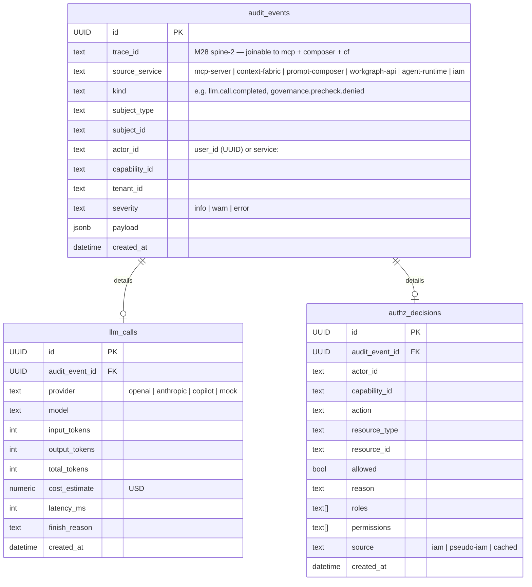
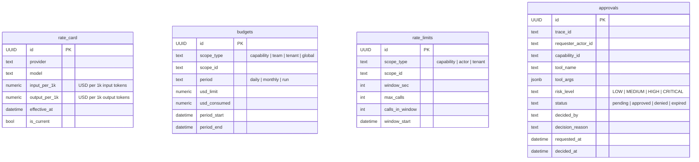
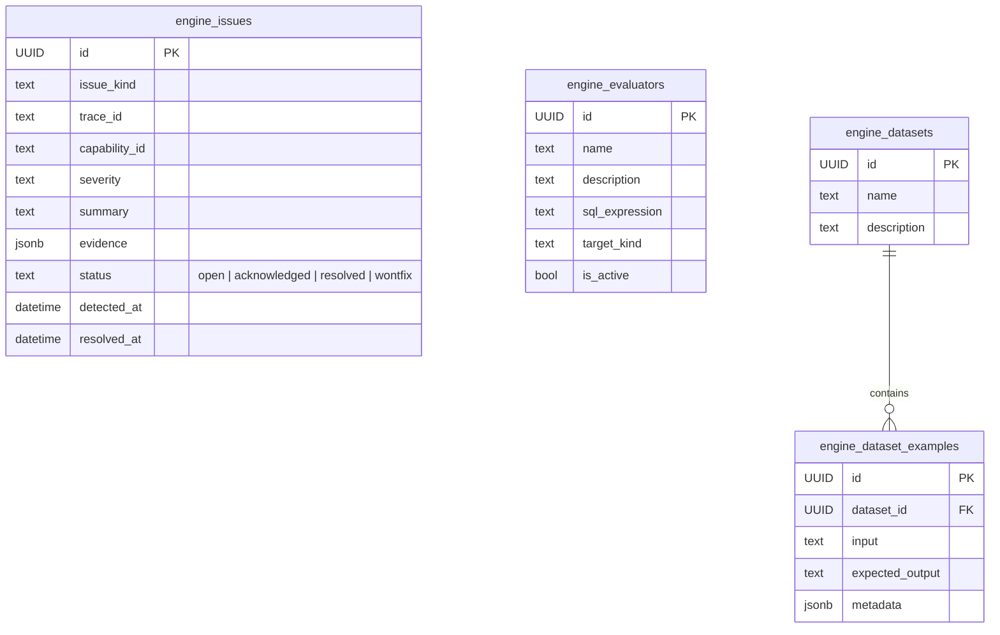

# Audit-Governance — `audit_governance`

> **Hand-curated.** Source of truth: [`audit-governance-service/db/init.sql`](../../audit-governance-service/db/init.sql) (raw DDL, schema `audit_governance.*`). 11 tables. Edit this file when the DDL changes.

Owner: `audit-governance-service` (TypeScript · Express · `pg`). Receives **fire-and-forget audit events** from every other service, plus serves **synchronous pre-flight checks** (budget, rate-limit, governance policy) for the `governanceMode=fail_closed` path.

This is the **only DB you can SQL-join across all platform activity** — every event carries `trace_id`, `capability_id`, `actor_id`, `subject_id` from upstream producers.

## Event spine

`audit_events` is the parent for typed sub-records. `llm_calls` + `authz_decisions` link 1:1 to their parent via `audit_event_id`. Most audit events have NO sub-record (they're just `kind` + `payload`).

## Governance pre-flight tables

These are read synchronously during cf `/execute` and mcp-server loop iterations to decide budget + rate + approval gates.

`rate_card` is the cost catalog (one row per provider+model+effective-window; LLM calls in `llm_calls` get `cost_estimate` = `tokens × rate`). `budgets` and `rate_limits` are mutated atomically on every `/execute` pre-flight. `approvals` is the governance side of the workgraph approval queue — workgraph keeps its own approval table for the in-flight workflow state.

## Engine (Singularity Engine M-something — automated failure triage)

Used by the Singularity Engine to triage recurring failure patterns in the audit ledger. Out of scope for most readers.

## Inbound references (who writes what)

| Producer service | Writes to | Trigger |
|---|---|---|
| `mcp-server` | `audit_events`, `llm_calls` | every LLM call, every tool invocation, every approval pause, every code-change commit |
| `context-fabric` | `audit_events` (incl. `governance.precheck.*`), `authz_decisions` | `/execute` orchestration |
| `prompt-composer` | `audit_events` (`prompt.assembly.created`, `compose.capsule.compile.alert`) | every compose call |
| `agent-runtime` | `audit_events` (`agent.template.derived`, `tool.grant.created`) | template + grant CRUD |
| `workgraph-api` | `audit_events` (workflow/run/task lifecycle), `approvals` (when governance gate fires) | DAG executor + approval-router |
| `singularity-iam-service` | `audit_events` (`iam.authz.decision`, `device.token.minted`, `device.revoked`), `authz_decisions` | auth + authz endpoints |

## Outbound references

| Column | Read by |
|---|---|
| `audit_events.trace_id` | Workgraph Run Insights timeline, `bin/test-trace-spine.sh`, mcp-server `/mcp/resources/*?trace_id=…` |
| `audit_events.capability_id` | governance pre-flights, Run Insights filtering |
| `llm_calls.cost_estimate` | `budgets.usd_consumed` updates, metrics-ledger dashboards |
| `approvals.id` | workgraph approval-router cross-reference |
