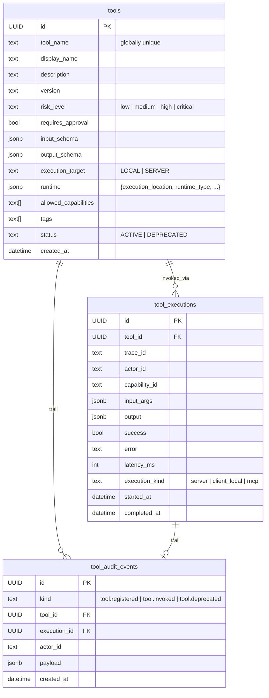
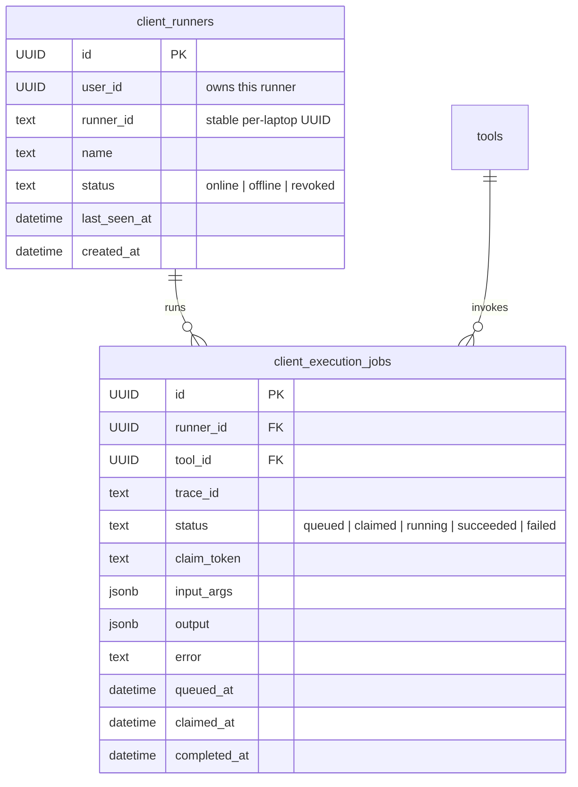
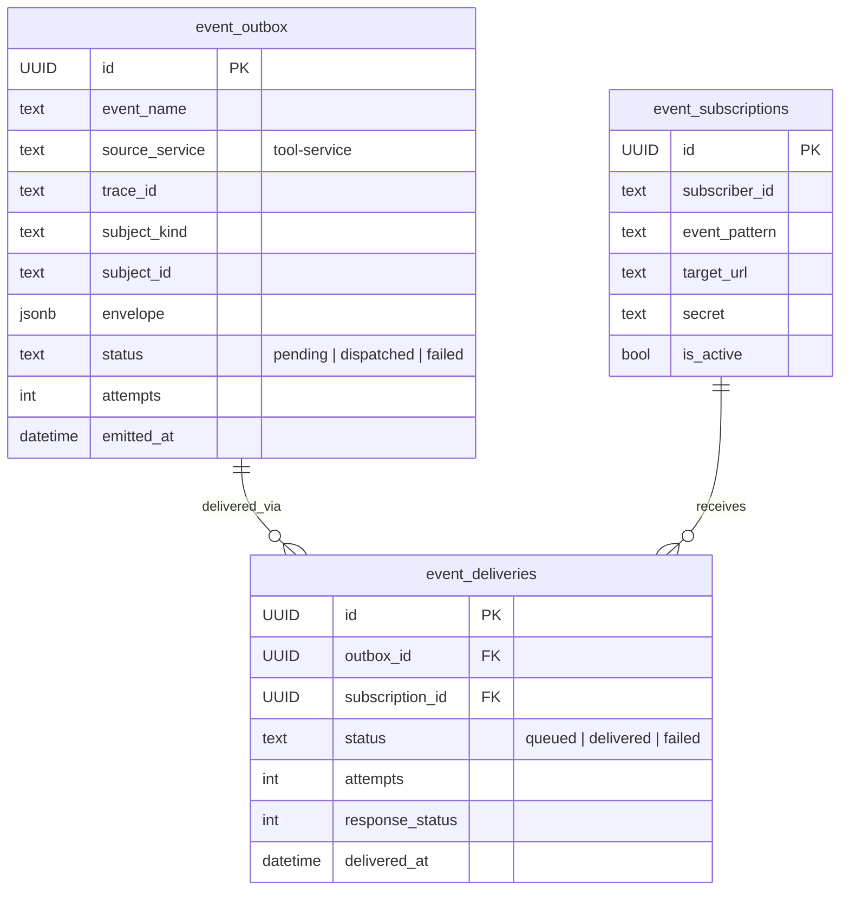

# Tool Service — `singularity.tool.*`

> **Hand-curated.** Source of truth: [`agent-and-tools/packages/db/init.sql`](../../agent-and-tools/packages/db/init.sql) (raw DDL, schema `tool.*` inside the shared `singularity` DB). 8 tables. Edit this file when the DDL changes.

Owner: `agent-and-tools/apps/tool-service` (TypeScript · Express · `pg`).

The tool service registry shares the `singularity` Postgres with agent-runtime but lives in a separate **Postgres schema** (`tool.*` vs `public.*`). It's the tool catalog + execution + client-runner state.

## Registry + execution

## Client runners (local-machine execution)

Used pre-M27 for client-local tool execution. Now mostly **superseded by mcp-server's local-tool registry** (which runs in-process on the laptop or VPC). Kept for legacy execution paths + audit history.

## Event bus (tool-service → audit-gov + subscribers)

Same shape as the IAM and agent-runtime event-outbox tables. Tool-service publishes its own bus and the audit-gov subscriber drains it.

## Cross-DB outbound references

| Column | Used by |
|---|---|
| `tools.id` | `singularity.ToolGrant.toolId` (agent-runtime's grants reference these), `workgraph.tools.externalToolId` (snapshot) |
| `tools.tool_name` | mcp-server invoke envelopes — the LLM picks tools by `tool_name`, not UUID |
| `tool_executions.trace_id` | joinable to `audit_governance.audit_events.trace_id` for full run reconstruction |
| `client_runners.user_id` | `singularity_iam.users.id` (the owning operator) |

## Why this lives inside `singularity` and not its own DB

The `tool.*` tables share a connection pool with agent-runtime's `public.*` tables. After M30 we split prompt-composer into its own DB but kept tool-service co-resident with agent-runtime because:
- agent-runtime's `ToolDefinition` model (in `public.ToolDefinition`) is the **typed catalog** used during prompt assembly; `tool.tools` is the **runtime + grants catalog** used during execution. They reference each other by `tool_name` (1:1).
- Splitting `tool.*` to its own DB would require either an HTTP refactor of every grant-resolution call site or a 2nd Prisma client — neither has a forcing function today.

If/when this changes (e.g. tool-service goes multi-tenant), the same `output = "../generated/..."` per-service-client pattern that prompt-composer uses today is the migration template.
