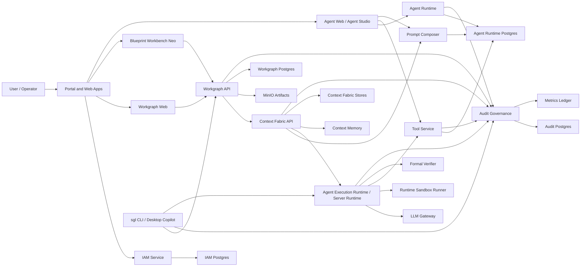
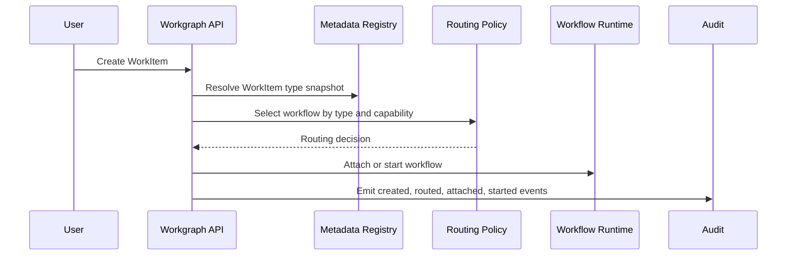
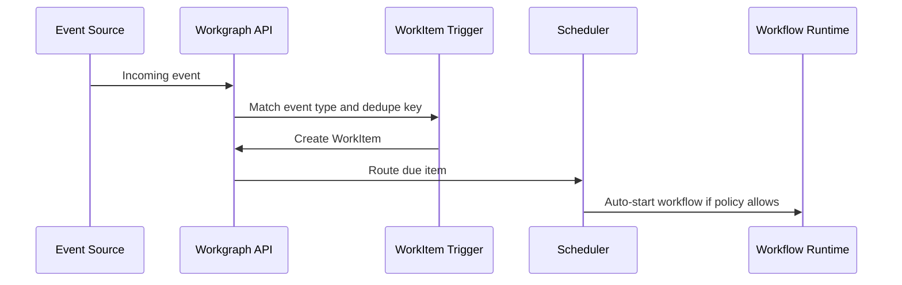
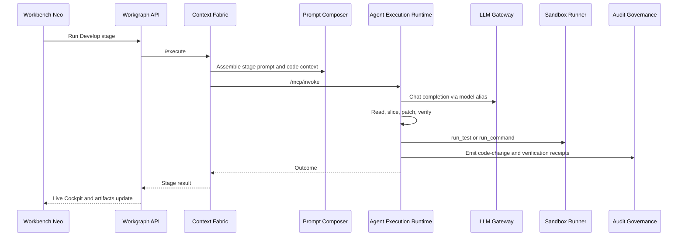
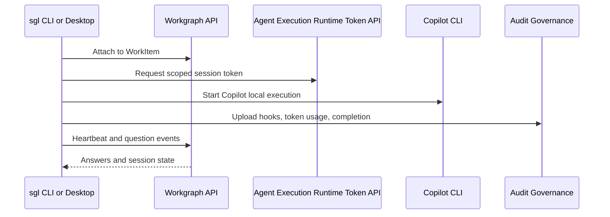

# Singularity Platform Handbook

Last verified from the local repository layout on 2026-05-22.

This handbook documents the Singularity platform as a whole: capabilities, components, service connections, features, installation, configuration, operations, and common extension paths. It is intended for engineers, operators, and product owners who need a single detailed map of how the system works.

## Contents

- [1. Executive Summary](#1-executive-summary)
- [2. Core Concepts](#2-core-concepts)
- [3. High-Level Architecture](#3-high-level-architecture)
- [4. Runtime Rule: Who Talks To The LLM](#4-runtime-rule-who-talks-to-the-llm)
- [5. Service Inventory](#5-service-inventory)
- [6. Repository Layout](#6-repository-layout)
- [7. Major Capabilities And Features](#7-major-capabilities-and-features)
- [8. WorkItem Metadata And Routing Model](#8-workitem-metadata-and-routing-model)
- [9. Important API Surfaces](#9-important-api-surfaces)
- [10. Installation](#10-installation)
- [11. Configuration](#11-configuration)
- [12. Operations](#12-operations)
- [13. Common Runtime Flows](#13-common-runtime-flows)
- [14. Governance And Security](#14-governance-and-security)
- [15. Observability](#15-observability)
- [16. Developer Extension Guide](#16-developer-extension-guide)
- [17. Troubleshooting](#17-troubleshooting)
- [18. Release Checklist](#18-release-checklist)
- [19. Existing Detailed References](#19-existing-detailed-references)

## 1. Executive Summary

Singularity is a governed enterprise agent platform. It brings together identity, capabilities, WorkItems, workflow orchestration, agent templates, prompt composition, context optimization, runtime tool execution, sandboxed command execution, audit governance, cost tracking, formal verification, and optional laptop-driven Copilot execution.

The central design rule is:

```text
Business work starts as a WorkItem.
Workflow runs are execution attempts attached to that WorkItem.
Agentic work goes through Context Fabric and Agent Execution Runtime.
The Agent Execution Runtime is the controlled runtime boundary for LLM and tool execution.
Audit and receipts make the whole path observable.
```

The platform supports two execution modes:

- **Server runtime mode**: Workgraph sends agent work to Context Fabric, Context Fabric invokes Agent Execution Runtime, Agent Execution Runtime calls the LLM Gateway and tools.
- **Laptop Copilot mode**: a local CLI or desktop app runs Copilot directly, while Singularity records events, questions, token usage, audit receipts, and WorkItem status.

## 2. Core Concepts

| Concept | Meaning |
|---|---|
| Capability | A business or technical domain that owns agents, workflows, WorkItems, policies, and memberships. |
| WorkItem | The first-class unit of business work. WorkItems can be created manually, from events, from schedules, or by parent workflows. |
| WorkItem Type | Metadata that describes what a WorkItem means, what fields it needs, how it routes, and which workflows can handle it. Examples: `BUG_FIX`, `FEATURE`, `INCIDENT`, `RESEARCH`, `GENERAL`. |
| Workflow Template | A reusable process definition made of nodes, edges, routing rules, and runtime policy. |
| Workflow Type | Metadata that describes what class of workflow this is and which WorkItem types it can handle. |
| Workflow Instance | One running execution of a workflow template. |
| Node Type | Runtime executor base plus metadata describing UI, config schema, validation, inputs, outputs, and edge rules. |
| Agent Template | A role-specific prompt, model, governance, and tool policy definition. |
| Prompt Composer | The service that owns prompt profiles, prompt layers, stage prompts, prompt assemblies, and reusable lessons. |
| Context Fabric | The orchestration layer for context assembly, optimized context packages, agent execution calls, receipts, and trace continuity. |
| Agent Execution Runtime | The local/server runtime surface for tools, code intelligence, editing, verification, discovery, session tokens, and LLM invocation. |
| LLM Gateway | Provider abstraction and model alias gateway. In the server runtime path, Agent Execution Runtime calls this gateway. |
| Audit Governance | Cross-service audit, receipts, budgets, rate limits, governance decisions, and cost evidence. |
| Code Context Budgeter | AST-first context selector that builds compact code-context packages for developer agents. |

## 3. High-Level Architecture



## 4. Runtime Rule: Who Talks To The LLM

For server-side agentic execution, Singularity should preserve this rule:

```text
Workbench / Workgraph -> Context Fabric -> Agent Execution Runtime -> LLM Gateway -> Provider
```

Other services can request execution, assemble context, route WorkItems, and record audit events, but they should not call providers directly. This keeps cost, traceability, prompt policy, tool policy, and model alias resolution in one governed path.

Laptop Copilot mode is intentionally different: Copilot runs on the user's machine, and Singularity records lifecycle events, audit evidence, questions, token usage, and completion status.

## 5. Service Inventory

Run `./singularity.sh urls` to print the current local endpoint map.

### Web Applications

| Service | Local URL | Purpose |
|---|---:|---|
| `portal` | `http://localhost:5180` | Branded entry point and shell around the platform. |
| `user-and-capability` | `http://localhost:5175` | IAM administration, users, teams, capabilities, roles, skills, and permissions. |
| `workgraph-web` | `http://localhost:5174` | Workflow manager, workflow designer, WorkItem inbox, runs, approvals, metadata screens. |
| `blueprint-workbench` | `http://localhost:5176` | Workbench Neo staged delivery loop for story-to-delivery execution. |
| `agent-web` | `http://localhost:3000` | Agent Studio, operations, cost, audit, and control-plane routes. |
| `code-foundry-web` | configured by compose | Code Foundry UI for foundry runs and code generation workflows. |

### API and Runtime Services

| Service | URL | Responsibility |
|---|---:|---|
| `iam-service` | `http://localhost:8100/api/v1` | Authentication, JWTs, users, teams, roles, capabilities, memberships, and permissions. |
| `workgraph-api` | `http://localhost:8080/api` | WorkItems, workflows, workflow instances, tasks, approvals, metadata, triggers, artifact orchestration, and runs. |
| `agent-runtime` | `http://localhost:3003/api/v1` | Agent templates, tools metadata, capabilities, execution records, memory APIs, and event subscriptions. |
| `agent-service` | `http://localhost:3001/api/v1` | Agent application APIs and UI-facing agent service behavior. |
| `tool-service` | `http://localhost:3002/api/v1` | Tool registry, internal tools, connector tools, runner routes, and tool discovery. |
| `prompt-composer` | `http://localhost:3004/api/v1` | Prompt profiles, layers, assemblies, stage prompts, lessons, contracts, and compose/respond APIs. |
| `learning-service` | `http://localhost:3006/api/v1` | Hybrid learning summaries and patterns that complement Prompt Composer lessons. |
| `context-api` | `http://localhost:8000` | Context Fabric execution API, optimized context, laptop bridge, receipts, and Agent Execution Runtime orchestration. |
| `llm-gateway` | `http://localhost:8001` | Provider abstraction, model aliases, chat completions, embeddings, model/provider listing. |
| `context-memory` | `http://localhost:8002` | Conversation memory, summaries, semantic search, compiled context packages. |
| `metrics-ledger` | `http://localhost:8003` | Metrics, token/cost rollups, optimization savings, operational dashboards. |
| `formal-verifier` | `http://localhost:8010` | Formal verification service for constraints, policies, and verification receipts. |
| `mcp-server` | `http://localhost:7100` | Agent Execution Runtime, tools, resources, discovery, code context, invoke/resume, and token endpoints. |
| `mcp-sandbox-runner` | internal compose network | Docker-based command execution runner for `run_command` and `run_test`. |
| `code-foundry-api` | configured by compose | Code Foundry API for foundry-specific runs and artifacts. |
| `audit-governance-service` | commonly `http://localhost:8500` | Audit events, governance budgets, receipts, cost evidence, hook ingestion. |

### Storage

| Store | Local Port | Owned Data |
|---|---:|---|
| `iam-postgres` | `5433` | IAM users, teams, roles, capabilities, skills, permissions. |
| `at-postgres` | `5432` | Agent runtime, tool service, prompt composer, and related agent/tool/prompt data. |
| `wg-postgres` | `5434` | Workgraph workflows, WorkItems, workflow instances, metadata, triggers, questions, approvals. |
| `audit-governance-postgres` | commonly `5436` | Audit events, budgets, governance and cost evidence. |
| Context Fabric stores | service-specific | Context memory and metrics stores depending on local config. |
| `wg-minio` | `9000`, console `9001` | Artifacts, workflow attachments, generated documents, evidence packs. |

## 6. Repository Layout

| Path | Purpose |
|---|---|
| `singularity.sh` | Local operator wrapper for config, compose up/down, logs, doctor, urls, and status. |
| `docker-compose.yml` | Main local stack definition. |
| `seed/` | Baseline seed SQL for IAM, agent runtime, Workgraph, and audit governance. |
| `workgraph-studio/apps/api` | Workgraph API. |
| `workgraph-studio/apps/web` | Workgraph web app and workflow designer. |
| `workgraph-studio/apps/blueprint-workbench` | Workbench Neo UI. |
| `workgraph-studio/apps/sgl-cli` | Laptop CLI for work, attach, questions, logs, doctor, and Copilot workflows. |
| `workgraph-studio/apps/desktop` | Electron desktop app for laptop-driven Copilot execution. |
| `workgraph-studio/packages/laptop-sdk` | Shared SDK used by CLI and desktop. |
| `agent-and-tools/apps/agent-runtime` | Agent templates, capabilities, execution, and memory APIs. |
| `agent-and-tools/apps/tool-service` | Tool registry and connector tool service. |
| `agent-and-tools/apps/prompt-composer` | Prompt profiles, layers, assemblies, lessons, and contracts. |
| `agent-and-tools/apps/learning-service` | Hybrid learning API. |
| `mcp-server` | Agent Execution Runtime implementation: code intelligence, editing tools, verification, discovery, code context, LLM invocation. |
| `mcp-sandbox-runner` | Sandboxed command execution service. |
| `context-fabric` | Context API, LLM gateway, memory, metrics, and formal verification services. |
| `singularity-iam-service` | IAM Python service. |
| `singularity-portal` | Portal web application. |
| `UserAndCapabillity` | User and capability management UI. |
| `singularity-code-foundry` | Code Foundry API and web applications. |
| `docs/` | Architecture, data model, discovery, trace, and platform documentation. |

## 7. Major Capabilities And Features

### 7.1 Identity And Capability Management

Identity is owned by `iam-service` and the User and Capability UI.

Core features:

- Login and JWT issuance.
- Users, teams, roles, skills, permissions.
- Capability membership and ownership.
- Capability-scoped access decisions for WorkItems, workflows, agents, and metadata.
- IAM-backed default auth mode through `AUTH_PROVIDER=iam`.

### 7.2 Agent Studio

Agent Studio manages reusable and derived agent templates.

Core features:

- Locked common baselines for roles such as Architect, Developer, QA, Product Owner, Security, DevOps, and Governance.
- Capability-derived templates.
- Prompt profile and tool policy attachment.
- Model alias selection.
- Audit events for derivation and updates.

### 7.3 WorkItem Hub

WorkItems are the business object the platform routes, schedules, starts, detaches, and audits.

Core features:

- Manual WorkItem creation.
- Event-created WorkItems.
- Scheduled WorkItems using server time.
- Parent workflow delegated WorkItems.
- Routing modes: `MANUAL`, `AUTO_ATTACH`, `AUTO_START`, `SCHEDULED_START`.
- Routing states: `UNROUTED`, `ROUTED`, `ATTACHED`, `STARTED`, `ROUTE_FAILED`.
- Detach and attach workflows.
- WorkItem detail view with request packet, targets, child runs, route evidence, schedule, trigger source, and timeline.

### 7.4 Metadata Registry

The metadata registry makes WorkItem types, workflow types, node types, event types, and trigger profiles configurable without schema changes for every business type.

Definition kinds:

- `WORK_ITEM_TYPE`
- `WORKFLOW_TYPE`
- `NODE_TYPE`
- `EVENT_TYPE`
- `TRIGGER_PROFILE`

Resolution scope:

- `GLOBAL`
- `CAPABILITY`
- `WORKFLOW`
- `NODE`

Runtime objects store both metadata keys and snapshots so old runs do not change behavior when definitions evolve.

### 7.5 Workflow Designer

The workflow designer builds workflow templates from nodes and edges.

Core features:

- Miro-style large canvas direction.
- Workflow type metadata.
- Node type metadata.
- Node picker driven by metadata.
- Validation and issue panels.
- Design, Run, and Inspect concerns.
- Node configuration through inspector drawers.
- Routing, governance, inputs, outputs, retry, and advanced config sections.

### 7.6 Workflow Runtime

Workgraph executes workflow instances and manages tasks, artifacts, approvals, triggers, and WorkItems.

Common node families:

- Start and end nodes.
- Human tasks.
- Agent tasks.
- Approval gates.
- Tool requests.
- Git push and release readiness nodes.
- Workbench nodes.
- Timer, event gateway, and trigger-aware nodes.
- Custom nodes mapped to runtime executor bases.

### 7.7 Blueprint Workbench Neo

Workbench Neo is the staged story-to-delivery loop for agent-driven delivery.

Common stages:

- Story Intake.
- Plan.
- Design.
- Develop.
- Security Review.
- QA Review.
- Release Readiness.
- Test Certification.

Core features:

- Per-stage agent templates.
- Manual or automated gates.
- Expected artifacts.
- Approval and send-back flows.
- Live Cockpit events.
- Run Insights, cost, model, tool, verification, and code-change receipts.
- Developer gate requiring actual runtime/git code-change receipt.
- QA and certification gates requiring verification receipt or accepted-risk override.

### 7.8 Context Fabric

Context Fabric coordinates context assembly and agent execution.

Core features:

- `/execute` and `/execute/resume`.
- Context optimization and comparison.
- Context memory, summaries, and semantic search.
- Trace propagation.
- Context packages and receipts.
- Dependency state context.
- Laptop bridge compatibility.
- Calls to Prompt Composer for prompt assembly.
- Calls to Agent Execution Runtime for actual agent runtime invocation.

### 7.9 Prompt Composer

Prompt Composer owns reusable prompt construction.

Core features:

- Prompt profiles.
- Prompt layers.
- Prompt assemblies.
- Stage prompts.
- System prompts.
- Event Horizon actions.
- Engine lessons and global lessons.
- Contracts.
- Compose and respond endpoints.
- Debug retrieval.
- Code-aware prompt layer rendering.

### 7.10 Agent Execution Runtime / Server Runtime

The Agent Execution Runtime is the server runtime boundary for agentic coding and tools.

Core features:

- Tool listing and tool calls.
- Discovery endpoint.
- Resources endpoint.
- Events endpoint.
- Session token minting and revocation.
- Invoke and resume.
- Code intelligence.
- Differential edits and full-file write safeguards.
- Sandboxed command execution through runner.
- Verification receipts.
- Formal verification integration.
- Code Context Budgeter.
- LLM calls through LLM Gateway.

Important runtime tool families:

- File and code reading: `read_file`, `list_directory`, `search_code`.
- Code intelligence: `find_symbol`, `get_symbol`, `get_ast_slice`, `get_dependencies`, `find_references`, `find_tests`.
- Editing: `apply_patch`, `replace_text`, `replace_range`, `write_file`.
- Git and branch finishing: `finish_work_branch`, `finish_work_branch_auto`.
- Verification: `run_command`, `run_test`, `formal_verify`.
- Learning and memory: `query_learning_state`, `query_similar_capabilities`, `record_outcome_pattern`, `record_assumption`, `record_blocker`.
- Copilot advisory tools where enabled.

### 7.11 Code Context Budgeter

The Code Context Budgeter reduces coding-agent token usage by making AST-first context the default.

Target flow:

```text
Task -> Intent Detection -> Symbol Search -> AST Slice -> Dependency Expansion -> Token Budgeting -> Prompt Composer -> Context Fabric -> LLM
```

Core features:

- Code task classification.
- Target symbol resolution.
- Editable AST slices.
- Dependency slices.
- Relevant test slices.
- Type and interface contracts.
- Excluded context reasons.
- Token savings estimates.
- Full-file read policy and exception receipts.

### 7.12 Sandboxed Execution

`mcp-sandbox-runner` isolates command execution.

Target isolation properties:

- Ephemeral Docker containers.
- No network by default.
- Read-only root filesystem.
- Capability drops.
- No new privileges.
- CPU, memory, and process limits.
- Workspace-only mount.
- No provider keys or arbitrary host environment.

`run_command` and `run_test` return verification receipts with command, exit code, excerpts, duration, pass/fail, timeout state, and isolation metadata.

### 7.13 LLM Gateway

LLM Gateway abstracts providers and model aliases.

Core features:

- Provider listing.
- Model listing.
- Chat completions.
- Embeddings.
- Alias resolution.
- Usage and cost reporting when provider data is available.

Provider configuration is usually written from `.singularity/config.local.json` into local generated provider files.

### 7.14 Audit, Governance, And Cost

Audit Governance receives cross-service events and serves governance decisions.

Core features:

- Audit event ingestion.
- Hook ingestion.
- Governance budgets.
- Rate limits.
- Denied-call evidence.
- Cost and token rollups.
- Receipts.
- Run and capability correlation.
- Events for Agent Execution Runtime, Context Fabric, Workgraph, Tool Service, and Agent Runtime.

### 7.15 Learning Loop

The learning architecture is hybrid:

- `learning-service` owns summaries and pattern APIs.
- Prompt Composer `EngineLesson` remains the canonical prompt-lesson store.
- Prompt Composer merges learning summaries and patterns with existing global lessons.
- If the learning service is unavailable, prompt assembly should degrade gracefully.

See [M35 Hybrid Learning ADR](./adr/0001-m35-hybrid-learning.md).

### 7.16 Laptop CLI And Desktop

Laptop mode supports direct Copilot execution from the user's machine.

Core features:

- `sgl` CLI.
- Electron desktop app.
- Auth.
- WorkItem picker.
- Embedded Copilot terminal.
- Events and questions.
- Heartbeats.
- Local retry queue for uploads.
- Hook callbacks.
- Token usage upload.
- Completion events.
- Diagnostics and Copilot CLI version checks.

## 8. WorkItem Metadata And Routing Model

The WorkItem-first flow is:

```text
Event / Manual / Schedule
  -> WorkItem
  -> WorkItem Type Metadata
  -> Routing Policy
  -> Workflow Type
  -> Workflow Template
  -> Workflow Instance
  -> Nodes
```

### 8.1 WorkItem Fields

Important WorkItem metadata fields:

- `workItemTypeKey`
- `typeVersion`
- `typeSnapshot`
- `routingMode`
- `scheduledAt`
- `notBefore`
- `sourceEventTypeKey`
- `routingPolicyId`
- `routingState`

### 8.2 WorkItem Type Metadata

WorkItem type metadata defines:

- Required input fields.
- Default urgency, SLA, budget, and priority.
- Allowed source types: `MANUAL`, `EVENT`, `SCHEDULE`, `PARENT_WORKFLOW`.
- Allowed routing modes.
- Compatible workflow types.
- Assignment rules.
- Approval requirements.
- UI labels and forms.

### 8.3 Routing Policies

`WorkItemRoutingPolicy` connects a WorkItem type to a workflow type or workflow template.

Important fields:

- `capabilityId`
- `workItemTypeKey`
- `workflowTypeKey`
- `workflowId`
- `routingMode`
- `priority`
- `selector`
- `isActive`

### 8.4 Triggers

`WorkItemTrigger` creates WorkItems from events, schedules, or webhooks.

Important fields:

- `triggerType`: `EVENT`, `SCHEDULE`, `WEBHOOK`
- `eventTypeKey`
- `capabilityId`
- `workItemTypeKey`
- `routingMode`
- `scheduleConfig`
- `payloadMapping`
- `dedupeKey`
- `isActive`

Scheduling uses server time and database locks for idempotency.

## 9. Important API Surfaces

### 9.1 Workgraph API

Mounted under `http://localhost:8080/api`.

Important route groups:

- `/auth`
- `/users`, `/teams`, `/identity`, `/roles`, `/skills`, `/permissions`
- `/workflow-templates`
- `/workflows`
- `/workflow-instances`
- `/workflow-triggers`
- `/custom-node-types`
- `/triggers/webhook`
- `/tasks`
- `/metadata-definitions`
- `/work-item-routing-policies`
- `/work-item-triggers`
- `/work-items`
- `/laptop-invocations`
- `/questions`
- `/approvals`
- `/consumable-types`, `/consumables`
- `/agents`, `/agent-runs`
- `/tools`, `/tool-runs`
- `/audit`, `/connectors`
- `/artifact-templates`
- `/blueprint`
- `/event-horizon`
- `/contracts`
- `/documents`
- `/runtime`, `/runs`, `/llm`, `/notify`
- `/lookup`
- `/agent-studio`
- `/receipts`
- `/events/subscriptions`, `/events/incoming`
- `/admin/feature-flags`, `/internal/feature-flags`

### 9.2 Agent Execution Runtime API

Mounted under `http://localhost:7100`.

Important endpoints:

- `GET /health`
- `GET /healthz/strict`
- `GET /llm/providers`
- `GET /llm/models`
- `POST /mcp/tokens`
- `POST /mcp/tokens/:jti/revoke`
- `POST /mcp/invoke`
- `POST /mcp/resume`
- `GET /mcp/tools/list`
- `POST /mcp/tools/call`
- `GET /mcp/resources`
- `GET /mcp/events`
- `GET /mcp/discovery`
- `POST /mcp/embed`
- `POST /mcp/code-context/build`

### 9.3 Context Fabric API

Mounted under `http://localhost:8000`.

Important endpoints:

- `GET /health`
- `GET /healthz/strict`
- `POST /execute`
- `POST /execute/resume`
- `GET /execute/calls`
- `GET /execute/events`
- `GET /execute/events/stream`
- `POST /context/compare`
- `GET /metrics/dashboard`
- `GET /receipts`
- `/internal/mcp/...`
- `/api/laptop-bridge/connect`
- `/api/laptop-bridge/status`

### 9.4 Prompt Composer API

Mounted under `http://localhost:3004/api/v1`.

Important endpoints:

- `/prompt-profiles`
- `/prompt-layers`
- `/prompt-assemblies`
- `/compose-and-respond`
- `/compose-and-respond/debug-retrieval`
- `/compiled-contexts`
- `/stage-prompts`
- `/system-prompts`
- `/event-horizon-actions`
- `/lessons`
- `/contracts`

### 9.5 Agent Runtime API

Mounted under `http://localhost:3003/api/v1`.

Important endpoints:

- `/agents`
- `/tools`
- `/capabilities`
- `/executions`
- `/memory`
- `/events/subscriptions`

### 9.6 Tool Service API

Mounted under `http://localhost:3002/api/v1`.

Important endpoints:

- `/tools`
- `/internal-tools`
- `/connector-tools`
- `/events/subscriptions`
- runner routes under `/api/v1`

## 10. Installation

### 10.1 Prerequisites

Install:

- Docker Desktop with Compose v2.
- Git.
- Curl.
- PostgreSQL client tools, optional but useful for seed and inspection.
- Node.js and pnpm for local package work.
- Python tooling for IAM and Context Fabric local development.

Keep these ports available:

```text
3000, 3001, 3002, 3003, 3004, 3006
5174, 5175, 5176, 5180
7100
8000, 8001, 8002, 8003, 8010
8080, 8100, 8500
5432, 5433, 5434, 5436
9000, 9001
```

### 10.2 Clone

```bash
git clone https://github.com/ashokraj2011/singularity-platform.git
cd singularity-platform
```

### 10.3 Initialize Local Config

```bash
./singularity.sh config init --profile office-laptop
./singularity.sh config mcp-catalog --default-alias mock
./singularity.sh config write
```

Local config files live under `.singularity/` and generated env files are ignored by git. Keep provider keys and secrets local.

### 10.4 Start The Stack

```bash
./singularity.sh up
```

This starts the main Docker Compose stack and the audit-governance side stack.

### 10.5 Apply Seeds

```bash
PGPASSWORD=singularity psql -h localhost -p 5433 -U singularity -d singularity_iam -f seed/00-iam.sql
PGPASSWORD=singularity psql -h localhost -p 5432 -U postgres -d singularity -f seed/01-agent-runtime.sql
PGPASSWORD=workgraph_secret psql -h localhost -p 5434 -U workgraph -d workgraph -f seed/02-workgraph.sql
PGPASSWORD=audit psql -h localhost -p 5436 -U postgres -d audit_governance -f seed/03-audit-governance.sql
```

Seeds are designed to be safe to re-run.

### 10.6 Verify Health

```bash
./singularity.sh status
./singularity.sh urls

curl -fsS http://localhost:8080/health
curl -fsS http://localhost:8100/api/v1/health
curl -fsS http://localhost:8000/health
curl -fsS http://localhost:7100/health
```

### 10.7 Login

Use the seeded admin account:

```text
admin@singularity.local
Admin1234!
```

Open:

- `http://localhost:5175/login` for IAM.
- `http://localhost:5174` for Workgraph.
- `http://localhost:5176` for Workbench Neo.
- `http://localhost:3000` for Agent Studio and Operations.

## 11. Configuration

### 11.1 Local Config Files

Important local files:

- `.singularity/config.local.json`
- `.singularity/llm-providers.json`
- `.singularity/mcp-models.json`
- generated service env files created by `./singularity.sh config write`

### 11.2 Common Environment Areas

| Area | Examples |
|---|---|
| IAM | `AUTH_PROVIDER`, IAM base URLs, JWT secrets, service tokens. |
| LLM | provider keys, provider URLs, default model aliases, model catalog files. |
| Agent Execution Runtime | bearer token, model alias, LLM gateway URL, command execution mode, runner URL, runner token. |
| Runner | default image, image map, network mode, host workspace path. |
| Context Fabric | Agent Execution Runtime URL, Prompt Composer URL, Agent Runtime URL, LLM Gateway URL. |
| Workgraph | database URL, MinIO config, IAM config, feature flags. |
| Audit | audit DB URL, governance budgets, hook service auth. |

### 11.3 Model Providers

Model aliases should be configured through the local catalog and gateway-facing provider config. Workbench stages should use model aliases, not raw provider strings.

Common checks:

```bash
curl -fsS http://localhost:7100/llm/providers
curl -fsS http://localhost:7100/llm/models
curl -fsS http://localhost:8001/llm/providers
curl -fsS http://localhost:8001/llm/models
```

If a run fails with `unknown model alias`, fix the alias in the stage config, runtime model catalog, or LLM Gateway config.

## 12. Operations

### 12.1 Start

```bash
./singularity.sh up
```

### 12.2 Stop

```bash
./singularity.sh down
```

This preserves data volumes.

### 12.3 Restart

```bash
./singularity.sh down
./singularity.sh up
```

### 12.4 Status And URLs

```bash
./singularity.sh status
./singularity.sh urls
```

### 12.5 Logs

```bash
./singularity.sh logs workgraph-api -f
./singularity.sh logs mcp-server -f
./singularity.sh logs context-api -f
```

### 12.6 Destructive Reset

```bash
./singularity.sh nuke
```

Use only when you intend to delete local data volumes.

## 13. Common Runtime Flows

### 13.1 Manual WorkItem To Workflow



### 13.2 Event To Auto-Started WorkItem



### 13.3 Developer Stage In Workbench



### 13.4 Laptop Copilot Invocation



## 14. Governance And Security

### 14.1 Authentication

User-facing APIs should require IAM authentication. Service-to-service APIs should require service tokens. Laptop session JWTs carry origin, client, scopes, and revocation metadata.

### 14.2 Capability Scoping

New WorkItem, workflow, metadata, laptop, and question APIs should enforce capability membership even before strict tenant isolation.

### 14.3 Tenant Isolation

Non-strict mode is still authenticated and capability-scoped. Strict mode should add row-level tenant isolation and stricter service-token scoping.

### 14.4 Tool Risk

Mutating tools should be treated as risky by default:

- file edits
- command execution
- branch finishing
- connector mutation
- delegated service actions

Risky tools should produce receipts and should be approval-gated where policy requires it.

### 14.5 Command Execution

Command execution should prefer container mode. Process mode is a local/test escape hatch only.

Allowed command classes:

- tests
- lint
- typecheck
- build
- read-only diagnostics

Denied command classes:

- installs
- publishes
- deployments
- destructive filesystem operations
- shell operators
- absolute command paths
- secret environment access

## 15. Observability

### 15.1 Trace IDs

Every runtime path should carry correlation identifiers:

- `traceId`
- `runId`
- `capabilityId`
- `workflowInstanceId`
- `workflowNodeId`
- `workItemId`
- `agentRunId`

### 15.2 Receipts

Important receipt types:

- code change
- verification result
- formal verification
- approval wait
- approval decision
- context package
- full-file read exception
- LLM call completed
- governance denied
- route decision
- schedule fired
- WorkItem attached or detached

### 15.3 Dashboards

Key places to inspect behavior:

- Workbench Live Cockpit.
- Workbench Run Insights.
- Workgraph Run Insights.
- Operations portal.
- Audit event stream.
- Cost dashboard.
- Metrics Ledger.

## 16. Developer Extension Guide

### 16.1 Add A WorkItem Type

1. Create or update a `MetadataDefinition` with kind `WORK_ITEM_TYPE`.
2. Define schema, defaults, routing modes, compatible workflow types, UI form fields, and policy.
3. Add a `WorkItemRoutingPolicy` for the capability.
4. Optionally add a `WorkItemTrigger`.
5. Create a WorkItem and verify the resolved type snapshot.

### 16.2 Add A Workflow Type

1. Create a `MetadataDefinition` with kind `WORKFLOW_TYPE`.
2. Set compatible WorkItem types.
3. Mark default workflow templates where appropriate.
4. Define governance and evidence expectations.
5. Verify new WorkItems route to the intended workflow.

### 16.3 Add A Node Type

1. Create `MetadataDefinition(kind=NODE_TYPE)`.
2. Map it to a runtime executor base.
3. Define config schema, display category, input/output contracts, and edge rules.
4. Add node picker metadata.
5. Add validation tests and a designer smoke test.

### 16.4 Add A Runtime Tool

1. Implement the tool in `mcp-server/src/tools`.
2. Add schema, risk classification, and output envelope.
3. Register it in the local tool registry.
4. Add it to discovery output.
5. Add tests for success, validation, policy, and receipt shape.
6. Update Prompt Composer tool contracts if agents should prefer it.

### 16.5 Add A Prompt Layer

1. Add the layer in Prompt Composer.
2. Decide where it is retrieved and in what order it renders.
3. Add deterministic rendering tests.
4. Add debug retrieval output.
5. Verify Context Fabric receives and forwards the expected prompt package.

### 16.6 Add A Model Alias

1. Add provider configuration in local generated config.
2. Add or update runtime model catalog alias.
3. Verify through `/llm/models`.
4. Select the alias in stage config or agent template.
5. Run a small smoke stage and confirm usage/cost rolls up.

## 17. Troubleshooting

### 17.1 Port Already In Use

```bash
lsof -i :5174
lsof -i :8080
lsof -i :7100
```

Stop the conflicting process or change the port mapping.

### 17.2 Unknown Model Alias

Symptom:

```text
LLM_GATEWAY_UPSTREAM 400: unknown model alias
```

Check:

- Workbench stage selected alias.
- runtime model catalog.
- LLM Gateway provider config.
- `./singularity.sh config write` was run after config changes.

### 17.3 Workspace Locked

Symptom:

```text
workspace is locked: /workspace
```

Usually a previous Agent Execution Runtime invocation is still holding the workspace lock or a run crashed before release. Check Agent Execution Runtime logs and running invocations before deleting lock files.

### 17.4 Git Workspace Error

Symptom:

```text
ENOTDIR: not a directory, open '/workspace/.../.git/info/exclude'
```

This usually means a workspace path is not a normal git checkout or `.git` is a file pointing elsewhere. Re-materialize the workspace or use a proper worktree-aware git path routine.

### 17.5 Provider Rate Limit

Symptom:

```text
provider returned 429
```

Options:

- Reduce max input tokens.
- Use Code Context Budgeter.
- Lower history limits.
- Use a smaller or less rate-limited model alias.
- Retry after provider reset.

### 17.6 Runner Unavailable

Check:

```bash
curl -fsS http://localhost:7100/healthz/strict
./singularity.sh logs mcp-sandbox-runner -f
```

If command execution mode is `container`, Agent Execution Runtime should not silently fall back to host process execution.

### 17.7 Stale UI

If UI changes do not appear:

```bash
./singularity.sh logs workgraph-web -f
./singularity.sh logs blueprint-workbench -f
docker compose restart workgraph-web blueprint-workbench
```

Also hard-refresh the browser and confirm the browser is pointing at the expected port.

## 18. Release Checklist

Before a platform release:

- All services build.
- Unit tests pass for changed services.
- Health and strict-health endpoints pass.
- Seeds apply cleanly on a fresh stack.
- WorkItem creation works.
- WorkItem routing works.
- Workflow designer loads.
- Workbench Neo runs a small staged workflow.
- Runtime discovery lists expected tools.
- Agent Execution Runtime code edit and verification smoke passes.
- Audit events are visible.
- Cost usage is recorded.
- Context Fabric trace propagates through Agent Execution Runtime and audit.
- Laptop CLI doctor passes or reports actionable setup guidance.
- Documentation is updated for changed APIs, ports, metadata, and operational steps.

## 19. Existing Detailed References

- [Data Model Overview](./data-model/00-platform-overview.md)
- [IAM Data Model](./data-model/01-iam.md)
- [Agent Runtime Data Model](./data-model/02-agent-runtime.md)
- [Prompt Composer Owned Tables](./data-model/03-prompt-composer-owned.md)
- [Prompt Composer Runtime Reads](./data-model/03-prompt-composer-runtime-read.md)
- [Workgraph Data Model](./data-model/04-workgraph.md)
- [Audit Governance Data Model](./data-model/05-audit-gov.md)
- [Tool Service Data Model](./data-model/06-tool-service.md)
- [Runtime Discovery](./runtime-discovery.md)
- [Trace Contract](./trace-contract.md)
- [M35 Hybrid Learning ADR](./adr/0001-m35-hybrid-learning.md)
