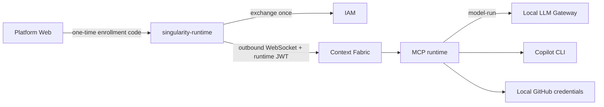

# Singularity Runtime Distribution

The Singularity Runtime is the user-installed MCP + local LLM host. It dials
out to Context Fabric over the Runtime Bridge; the platform never needs an
inbound MCP port on a laptop.



## Install

From a checked-out platform source tree:

```bash
bin/runtime-install.sh
singularity-runtime doctor
```

The installer adds a per-user command under `~/.local/bin`. It does not copy
`.env.local`, `JWT_SECRET`, database credentials, or another user's runtime
token.

## Enroll from Platform Web

1. Open **Settings → Runtime + LLM**.
2. Enter a runtime name and the Context Fabric base URL.
3. Create a one-time enrollment code.
4. On the laptop/server that will run MCP, execute the copied command:

```bash
singularity-runtime enroll \
  --url https://platform.example \
  --code SGR-XXXX-XXXX-XXXX-XXXX-XXXX-XXXX-XXXX-XXXX \
  --context-fabric-url https://context.example
```

The code expires quickly and is consumed once. IAM stores only a hash of it.
The exchange creates a `kind=runtime` JWT containing the user id (`sub`),
runtime id, tenant id when supplied, runtime scope, frame allow-list, and
capability tags. The CLI stores the resulting token in macOS Keychain or Linux
Secret Service. A mode-600 local file is used only when no OS credential store
is available.

For existing deployments, apply
`singularity-iam-service/db/migrations/002_runtime_enrollment.sql` before
enabling the enrollment screen. Local development IAM also creates the table
from the SQLAlchemy model during startup.

## Configure local providers

Provider keys stay on the runtime host. They are never sent to Platform Web,
Context Fabric, or the workflow definition.

```bash
singularity-runtime configure \
  --workspace "$HOME/singularity-workspace" \
  --default-provider anthropic \
  --default-model claude-3-5-sonnet

# Prefer environment variables or a secure prompt for secrets.
export GITHUB_TOKEN=github_pat_...
export ANTHROPIC_API_KEY=sk-ant-...
singularity-runtime configure
```

Copilot uses one governed path only:

```text
WorkGraph → Context Fabric → Runtime Bridge → MCP → copilot_execute → Copilot CLI
```

Set `COPILOT_BIN` or pass `--copilot-bin`. Do not configure Copilot as an LLM
Gateway provider. Anthropic, OpenAI, OpenRouter, and mock are local Gateway
providers.

## Start and operate

```bash
singularity-runtime start
singularity-runtime status
singularity-runtime doctor
singularity-runtime logs mcp-server
singularity-runtime logs llm-gateway
singularity-runtime stop
singularity-runtime revoke
singularity-runtime logout
```

`doctor` inventories every client-side variable without printing secret values:
runtime enrollment, bridge URL, provider keys, Git/Copilot readiness, local
paths, fallback mode, and required executables. A missing runtime token or
runtime id is blocking; provider and Git values are conditional warnings until
the selected workflow needs them.

`start` passes the token to the MCP process in memory and does not write the
runtime token into the repository's `.singularity/laptop-device-token`. The
browser can also revoke a runtime from Identity → Devices; `revoke` is the
self-service equivalent for the enrolled runtime.

## Personal and shared runtimes

- **Personal** is the default. Context Fabric routes runs for the enrolling
  user to that runtime.
- **Tenant** is an admin-created runtime for a tenant. It is eligible when a
  user runtime is not connected and the run is in that tenant.
- **Shared** is an admin-created fallback runtime. It should be used only for
  approved, non-personal workloads and should use brokered Git credentials.

The runtime id is not the user id. IAM binds the runtime token to both: `sub`
identifies the user owner, while `runtime_id` identifies the specific process.
Context Fabric uses user + tenant + runtime scope for routing and checks the
token's frame and capability claims before dispatch.

## Troubleshooting

```bash
singularity-runtime doctor
curl https://context.example/health
```

- `RUNTIME_NOT_CONNECTED`: start the CLI and verify the Context Fabric URL.
- `403` during WebSocket connect: create a fresh code and enroll again; do not
  copy `JWT_SECRET` to the runtime host.
- No Copilot stages: install `copilot`, set `COPILOT_BIN`, and authenticate the
  CLI on the runtime host.
- Provider not ready: configure the provider key locally and restart the
  runtime.
